# 鸿蒙开发从零开始之Basic_Services_Kit


---


[跳转到readme](https://github.com/hfreeman2008/Harmony-from-zero/blob/main/README.md)

---

[<font face='黑体' color=#ff0000 size=40 >跳转到文章结尾</font>](#Demo源码)

---

这篇文章主要目的是初步学习Basic Services Kit（基础服务）的使用；


# 为什么要了解Basic Services Kit

- 功能常用

Basic Services Kit（基础服务）作为基础服务套件，为应用开发者提供常用的基础能力。

比如常用的剪贴板读写、文件上传下载、文件压缩、文件打印、进程间/线程间通信、设备管理、应用账号管理等能力都由本Kit提供。

- 了解系统的第一个服务

前面我们了解的基本上都是应用框架部分的开发，但是对于HarmonyOS的系统的服务，我们基本上还没有了解。

那就从Basic Services Kit开始的。

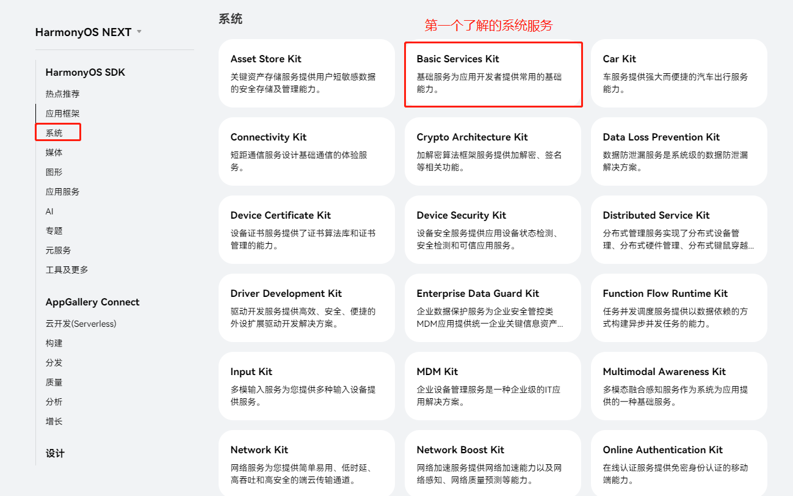

---


# Basic Services Kit的主要功能

根据不同使用场景分类，本Kit主要包含如下能力：

- 数据文件处理：

1. 剪贴板：提供内容复制粘贴能力，支持多种数据类型包括文本、HTML数据、URI、PixelMap等。
2. 压缩：提供文件压缩解压缩的能力。
3. 打印：提供基础文件打印的能力，比如传入文件进行打印、设置打印参数等。
4. 上传下载：提供文件上传下载、后台传输代理的基础能力。

- 进程间/线程间通信：

1. 公共事件：提供进程间通信的能力，包括订阅、发布、退订公共事件等，相关开发指南请参考公共事件简介。
2. Emitter：提供线程内通信的能力，包括订阅、发布、退订自定义事件等，相关开发指南请参考使用Emitter进行线程间通信。

- 设备管理：

1. 设备信息：提供查询产品信息的能力，比如查询设备类型、设备品牌名称、产品系列、产品版本号等。
2. 设置数据项：提供查询系统设置数据项的能力，比如查询是否启用飞行模式、是否启用触摸浏览等。
电量信息查询：提供查询电量信息的能力。
3. 系统电源管理：提供系统电源管理相关的能力，比如查询屏幕状态能力等。
4. RunningLock锁操作：提供RunningLock锁相关操作的能力，包括创建、查询、持锁、释放锁等操作。
5. 热管理：提供热管理相关的能力，比如热档位查询等。
6. USB管理：提供USB设备管理相关的能力，比如查询USB设备列表、批量数据传输、控制命令传输、权限控制等，相关开发指南请参考USB服务开发概述。

- 其他：

1. 应用账号管理：提供应用账号的期管理以及数据管理的能力，相关开发指南请参考管理应用账号。
2. 公共回调：定义了HarmonyOS ArkTS接口的公共回调类型，包括接口调用时出现的公共回调和公共错误信息。
3. 时间时区：提供获取系统时间以及系统时区的能力。

---

# 设备管理


---

## 电量信息

该模块主要提供电池状态和充放电状态的查询接口。

https://developer.huawei.com/consumer/cn/doc/harmonyos-references-V5/js-apis-battery-info-V5


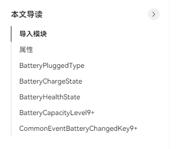

- 测试属性Demo接口

```java
let batterySOCInfo: number = batteryInfo.batterySOC;
console.info("The batterySOCInfo is: " + batterySOCInfo);

let chargingStatusInfo = batteryInfo.chargingStatus;
console.info("The chargingStatusInfo is: " + chargingStatusInfo);

let healthStatusInfo = batteryInfo.healthStatus;
console.info("The healthStatusInfo is: " + healthStatusInfo);

let pluggedTypeInfo = batteryInfo.pluggedType;
console.info("The pluggedTypeInfo is: " + pluggedTypeInfo);

let voltageInfo: number = batteryInfo.voltage;
console.info("The voltageInfo is: " + voltageInfo);

let technologyInfo: string = batteryInfo.technology;
console.info("The technologyInfo is: " + technologyInfo);

let batteryTemperatureInfo: number = batteryInfo.batteryTemperature;
console.info("The batteryTemperatureInfo is: " + batteryTemperatureInfo);

let isBatteryPresentInfo: boolean = batteryInfo.isBatteryPresent;
console.info("The isBatteryPresentInfo is: " + isBatteryPresentInfo);

let batteryCapacityLevelInfo = batteryInfo.batteryCapacityLevel;
console.info("The batteryCapacityLevelInfo is: " + batteryCapacityLevelInfo);
```


---

## 获取设备信息

本模块提供终端设备信息查询，开发者不可配置。

https://developer.huawei.com/consumer/cn/doc/harmonyos-references-V5/js-apis-device-info-V5


- 测试属性Demo接口

```java
let deviceTypeInfo: string = deviceInfo.deviceType;
console.info('the value of the deviceType is :' + deviceTypeInfo);

let manufactureInfo: string = deviceInfo.manufacture;
console.info('the value of the manufactureInfo is :' + manufactureInfo);

let brandInfo: string = deviceInfo.brand;
console.info('the value of the device brand is :' + brandInfo);

let marketNameInfo: string = deviceInfo.marketName;
console.info('the value of the deviceInfo marketName is :' + marketNameInfo);

let productSeriesInfo: string = deviceInfo.productSeries;
console.info('the value of the deviceInfo productSeries is :' + productSeriesInfo);

let productModelInfo: string = deviceInfo.productModel;
console.info('the value of the deviceInfo productModel is :' + productModelInfo);

let softwareModelInfo: string = deviceInfo.softwareModel;
console.info('the value of the deviceInfo softwareModel is :' + softwareModelInfo);

let hardwareModelInfo: string = deviceInfo.hardwareModel;
console.info('the value of the deviceInfo hardwareModel is :' + hardwareModelInfo);

let serialInfo: string = deviceInfo.serial;
console.info('the value of the deviceInfo serial is :' + serialInfo);

let bootloaderVersionInfo: string = deviceInfo.bootloaderVersion;
console.info('the value of the deviceInfo bootloaderVersion is :' + bootloaderVersionInfo);

let abiListInfo: string = deviceInfo.abiList;
console.info('the value of the deviceInfo abiList is :' + abiListInfo);

let securityPatchTagInfo: string = deviceInfo.securityPatchTag;
console.info('the value of the deviceInfo securityPatchTag is :' + securityPatchTagInfo);

let displayVersionInfo: string = deviceInfo.displayVersion;
console.info('the value of the deviceInfo displayVersion is :' + displayVersionInfo);

let incrementalVersionInfo: string = deviceInfo.incrementalVersion;
console.info('the value of the deviceInfo incrementalVersion is :' + incrementalVersionInfo);

let osReleaseTypeInfo: string = deviceInfo.osReleaseType;
console.info('the value of the deviceInfo osReleaseType is :' + osReleaseTypeInfo);

let osFullNameInfo: string = deviceInfo.osFullName;
console.info('the value of the deviceInfo osFullName is :' + osFullNameInfo);

let majorVersionInfo: number = deviceInfo.majorVersion;
console.info('the value of the deviceInfo majorVersion is :' + majorVersionInfo);

let seniorVersionInfo: number = deviceInfo.seniorVersion;
console.info('the value of the deviceInfo seniorVersion is :' + seniorVersionInfo);

let featureVersionInfo: number = deviceInfo.featureVersion;
console.info('the value of the deviceInfo featureVersion is :' + featureVersionInfo);

let buildVersionInfo: number = deviceInfo.buildVersion;
console.info('the value of the deviceInfo buildVersion is :' + buildVersionInfo);

let sdkApiVersionInfo: number = deviceInfo.sdkApiVersion;
console.info('the value of the deviceInfo sdkApiVersion is :' + sdkApiVersionInfo);

let firstApiVersionInfo: number = deviceInfo.firstApiVersion;
console.info('the value of the deviceInfo firstApiVersion is :' + firstApiVersionInfo);

let versionIdInfo: string = deviceInfo.versionId;
console.info('the value of the deviceInfo versionId is :' + versionIdInfo);

let buildTypeInfo: string = deviceInfo.buildType;
console.info('the value of the deviceInfo buildType is :' + buildTypeInfo);

let buildUserInfo: string = deviceInfo.buildUser;
console.info('the value of the deviceInfo buildUser is :' + buildUserInfo);

let buildHostInfo: string = deviceInfo.buildHost;
console.info('the value of the deviceInfo buildHost is :' + buildHostInfo);

let buildTimeInfo: string = deviceInfo.buildTime;
console.info('the value of the deviceInfo buildTime is :' + buildTimeInfo);

let buildRootHashInfo: string = deviceInfo.buildRootHash;
console.info('the value of the deviceInfo buildRootHash is :' + buildRootHashInfo);

let udid: string = deviceInfo.udid;
console.info('the value of the deviceInfo udid is :' + udid);

let distributionOSName: string = deviceInfo.distributionOSName
console.info('the value of the deviceInfo distributionOSName is :' + distributionOSName);

let distributionOSVersion: string = deviceInfo.distributionOSVersion
console.info('the value of the deviceInfo distributionOSVersion is :' + distributionOSVersion);

let distributionOSApiVersion: number = deviceInfo.distributionOSApiVersion
console.info('the value of the deviceInfo distributionOSApiVersion is :' + distributionOSApiVersion);

let distributionOSReleaseType: string = deviceInfo.distributionOSReleaseType
console.info('the value of the deviceInfo distributionOSReleaseType is :' + distributionOSReleaseType);

let odid: string = deviceInfo.ODID;
console.info('the value of the deviceInfo odid is :' + odid);
```


### 以productModel为例,我们查看源码中的具体实现：


对应deviceInfo类定义在：

interface/sdk-js/api/@ohos.deviceInfo.d.ts

```java
declare namespace deviceInfo {
  ......
/**
 * Obtains the product model represented by a string.
 *
 * @constant
 * @syscap SystemCapability.Startup.SystemInfo
 * @since 6
 */
/**
 * Obtains the product model represented by a string.
 *
 * @constant
 * @syscap SystemCapability.Startup.SystemInfo
 * @crossplatform
 * @since 10
 */
/**
 * Obtains the product model represented by a string.
 *
 * @constant
 * @syscap SystemCapability.Startup.SystemInfo
 * @crossplatform
 * @atomicservice
 * @since 11
 */
const productModel: string;
......
}
```


base/startup/init/interfaces/kits/jskits/src/native_deviceinfo_js.cpp

```cpp
static napi_value Init(napi_env env, napi_value exports)
{
    /*
     * Attribute definition
     */
    napi_property_descriptor desc[] = {
        {"deviceType", nullptr, nullptr, GetDeviceType, nullptr, nullptr, napi_default, nullptr},
        {"manufacture", nullptr, nullptr, GetManufacture, nullptr, nullptr, napi_default, nullptr},
        {"brand", nullptr, nullptr, GetBrand, nullptr, nullptr, napi_default, nullptr},
        {"marketName", nullptr, nullptr, GetMarketName, nullptr, nullptr, napi_default, nullptr},
        {"productSeries", nullptr, nullptr, GetProductSeries, nullptr, nullptr, napi_default, nullptr},
        {"productModel", nullptr, nullptr, GetProductModel, nullptr, nullptr, napi_default, nullptr},
        .....
}

static napi_value GetProductModel(napi_env env, napi_callback_info info)
{
    napi_value napiValue = nullptr;
    const char *productModel = GetProductModel();
    if (productModel == nullptr) {
        productModel = "";
    }

    NAPI_CALL(env, napi_create_string_utf8(env, productModel, strlen(productModel), &napiValue));
    return napiValue;
}
```


---

## 系统电源管理

该模块主要提供重启、关机、查询屏幕状态等接口。

https://developer.huawei.com/consumer/cn/doc/harmonyos-references-V5/js-apis-power-V5


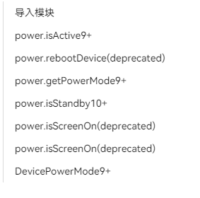

- 测试Demo接口
```java
try {
    let isActive = power.isActive();
    console.info('power is active: ' + isActive);
} catch(err) {
    console.error('check active status failed, err: ' + err);
}

//power.rebootDevice('reboot_test');

try {
    let mode = power.getPowerMode();
    console.info('power mode: ' + mode);
} catch(err) {
    console.error('get power mode failed, err: ' + err);
}

try {
    let isStandby = power.isStandby();
    console.info('device is in standby: ' + isStandby);
} catch(err) {
    console.error('check isStandby failed, err: ' + err);
}
  
```

---

## 热管理

该模块提供热管理相关的接口，包括热档位查询及注册回调等功能。

https://developer.huawei.com/consumer/cn/doc/harmonyos-references-V5/js-apis-thermal-V5

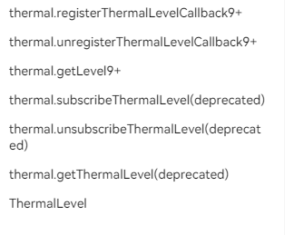


- 测试Demo接口

```java
try {
    let level = thermal.getLevel();
    console.info('thermal level is: ' + level);
} catch(err) {
    console.error('get thermal level failed, err: ' + err);
}

try {
    thermal.registerThermalLevelCallback((level: thermal.ThermalLevel) => {
    console.info('thermal level is: ' + level);
    });
    console.info('register thermal level callback success.');
} catch(err) {
    console.error('register thermal level callback failed, err: ' + err);
}

// try {
//   thermal.unregisterThermalLevelCallback(() => {
//     console.info('unsubscribe thermal level success.');
//   });
//   console.info('unregister thermal level callback success.');
// } catch(err) {
//   console.error('unregister thermal level callback failed, err: ' + err);
// }
```

---

## USB管理

本模块主要提供管理USB设备的相关功能，包括主设备上查询USB设备列表、批量数据传输、控制命令传输、权限控制等；从设备上端口管理、功能切换及查询等。

https://developer.huawei.com/consumer/cn/doc/harmonyos-references-V5/js-apis-usbmanager-V5

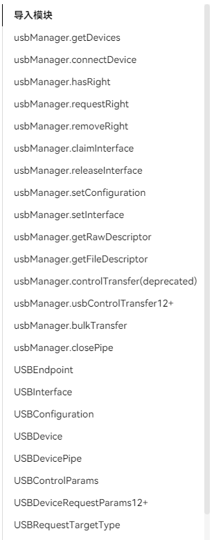


- 测试Demo接口

```java
let devicesList: Array<usbManager.USBDevice> = usbManager.getDevices();
console.log(`devicesList = ${devicesList}`);
/*
devicesList 返回的数据结构,此处提供一个简单的示例，如下
[
    {
    name: "1-1",
    serial: "",
    manufacturerName: "",
    productName: "",
    version: "",
    vendorId: 7531,
    productId: 2,
    clazz: 9,
    subClass: 0,
    protocol: 1,
    devAddress: 1,
    busNum: 1,
    configs: [
        {
        id: 1,
        attributes: 224,
        isRemoteWakeup: true,
        isSelfPowered: true,
        maxPower: 0,
        name: "1-1",
        interfaces: [
            {
            id: 0,
            protocol: 0,
            clazz: 9,
            subClass: 0,
            alternateSetting: 0,
            name: "1-1",
            endpoints: [
                {
                address: 129,
                attributes: 3,
                interval: 12,
                maxPacketSize: 4,
                direction: 128,
                number: 1,
                type: 3,
                interfaceId: 0,
                },
            ],
            },
        ],
        },
    ],
    },
]
*/
```

---

# 数据文件处理

## 剪贴板

本模块主要提供管理系统剪贴板的能力，为系统复制、粘贴功能提供支持。系统剪贴板支持对文本、HTML、URI、Want、PixelMap等内容的操作。

https://developer.huawei.com/consumer/cn/doc/harmonyos-references-V5/js-apis-pasteboard-V5


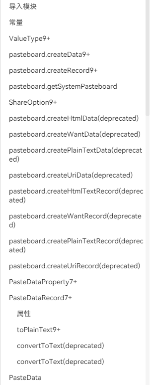


- 测试Demo接口

```java
let pasteData: pasteboard.PasteData = pasteboard.createData(pasteboard.MIMETYPE_TEXT_PLAIN, 'hello');
let plainText: string = pasteData.getPrimaryText();
console.info("plainText: " + plainText);

let systemPasteboard: pasteboard.SystemPasteboard = pasteboard.getSystemPasteboard();
console.info("获取系统剪贴板对象 systemPasteboard: " + systemPasteboard);

let listener = () => {
  console.info('The system pasteboard has changed.');
};
//监听系统剪贴板内容是否改变
systemPasteboard.on('update', listener);

//清除系统剪贴板内容
systemPasteboard.clearData((err, data) => {
  if (err) {
    console.error(`Failed to clear the pasteboard. Cause: ${err.message}`);
    return;
  }
  console.info('Succeeded in clearing the pasteboard.');
});

//清除系统剪贴板内容
systemPasteboard.clearData().then((data: void) => {
  console.info('Succeeded in clearing the pasteboard.');
}).catch((err: BusinessError) => {
  console.error(`Failed to clear the pasteboard. Cause: ${err.message}`);
});

//将数据写入系统剪贴板，使用callback异步回调
//let pasteData: pasteboard.PasteData = pasteboard.createData(pasteboard.MIMETYPE_TEXT_PLAIN, 'content');
systemPasteboard.setData(pasteData, (err, data) => {
  if (err) {
    console.error('Failed to set PasteData. Cause: ' + err.message);
    return;
  }
  console.info('Succeeded in setting PasteData.');
});
```

---

## 上传下载

request部件主要给应用提供上传下载文件、后台传输代理的基础能力。

https://developer.huawei.com/consumer/cn/doc/harmonyos-references-V5/js-apis-request-V5


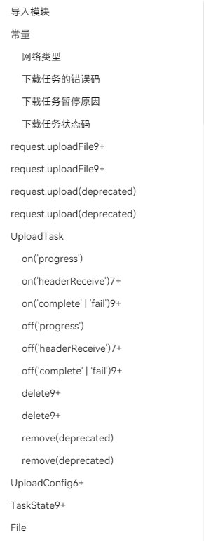


- 测试Demo接口

```java
//1. 上传
//上传，异步方法，使用promise形式返回结果，支持HTTP协议。通过on('complete'|'fail')9+可获取任务上传时的错误信息。
let uploadTask: request.UploadTask;
let uploadConfig: request.UploadConfig = {
  url: 'http://www.example.com', // 需要手动将 url 替换为真实服务器的 HTTP 协议地址
  header: { 'Accept': '*/*' },
  method: "POST",
  files: [{ filename: "test", name: "test", uri: "internal://cache/test.jpg", type: "jpg" }],
  data: [{ name: "name123", value: "123" }],
};
try {
  request.uploadFile(getContext(), uploadConfig).then((data: request.UploadTask) => {
    uploadTask = data;
  }).catch((err: BusinessError) => {
    console.error(`Failed to request the upload. Code: ${err.code}, message: ${err.message}`);
  });
} catch (err) {
  console.error(`Failed to request the upload. err: ${JSON.stringify(err)}`);
}

//2. 下载
//下载，异步方法，使用promise形式返回结果，支持HTTP协议。通过on('complete'|'pause'|'remove')7+可获取任务下载时的状态信息，包括任务完成、暂停或移除。通过on('fail')7+可获取任务下载时的错误信息。
try {
  // 需要手动将 url 替换为真实服务器的 HTTP 协议地址
  request.downloadFile(getContext(), { url: 'https://xxxx/xxxx.hap' }).then((data: request.DownloadTask) => {
    let downloadTask: request.DownloadTask = data;
  }).catch((err: BusinessError) => {
    console.error(`Failed to request the download. Code: ${err.code}, message: ${err.message}`);
  })
} catch (err) {
  console.error(`Failed to request the download. err: ${JSON.stringify(err)}`);
}

```

---

# 进程线程通信


## commonEventManager

本模块提供了公共事件相关的能力，包括发布公共事件、订阅公共事件、以及退订公共事件。

https://developer.huawei.com/consumer/cn/doc/harmonyos-references-V5/js-apis-commoneventmanager-V5

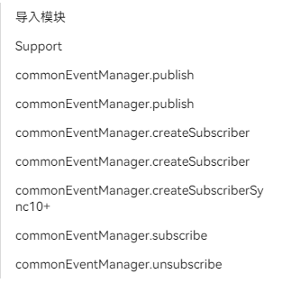


- 测试Demo接口

```java
//1. 定义订阅者，用于保存创建成功的订阅者对象，后续使用其完成订阅及退订的动作
let subscriber:commonEventManager.CommonEventSubscriber;
//2. 订阅者信息
let subscribeInfo:commonEventManager.CommonEventSubscribeInfo = {
  events: ["event"]
};

//3. 创建订阅者
try {
  commonEventManager.createSubscriber(subscribeInfo, (err: BusinessError, commonEventSubscriber:commonEventManager.CommonEventSubscriber) =>{
    if(!err) {
      console.info("createSubscriber success");
      subscriber = commonEventSubscriber;

      //4. 订阅公共事件
      try {
        commonEventManager.subscribe(subscriber, (err: BusinessError, data:commonEventManager.CommonEventData) => {
          if (err) {
            console.error(`subscribe failed, code is ${err.code}, message is ${err.message}`);
          } else {
            console.info("subscribe success, Consume callback " + JSON.stringify(data));
          }
        });
      } catch (error) {
        let err: BusinessError = error as BusinessError;
        console.error(`subscribe failed, code is ${err.code}, message is ${err.message}`);
      }

    } else {
      console.error(`createSubscriber failed, code is ${err.code}, message is ${err.message}`);
    }
  });
} catch (error) {
  let err: BusinessError = error as BusinessError;
  console.error(`createSubscriber failed, code is ${err.code}, message is ${err.message}`);
}

//5. 发布公共事件
try {
  commonEventManager.publish("event", (err: BusinessError) => {
    if (err) {
      console.error(`publish failed, code is ${err.code}, message is ${err.message}`);
    } else {
      console.info("publish success");
    }
  });
} catch (error) {
  let err: BusinessError = error as BusinessError;
  console.error(`publish failed, code is ${err.code}, message is ${err.message}`);
}

//6. 取消订阅公共事件
// 等待异步接口subscribe执行完毕，开发者根据实际业务选择是否需要添加setTimeout
setTimeout(() => {
  try {
    commonEventManager.unsubscribe(subscriber, (err: BusinessError) => {
      if (err) {
        console.error(`unsubscribe failed, code is ${err.code}, message is ${err.message}`);
      } else {
        console.info("unsubscribe success");
      }
    });
  } catch (error) {
    let err: BusinessError = error as BusinessError;
    console.error(`unsubscribe failed, code is ${err.code}, message is ${err.message}`);
  }
}, 500);
```

---

## emitter

本模块提供了在同一进程不同线程间，或同一进程同一线程内，发送和处理事件的能力，包括持续订阅事件、单次订阅事件、取消订阅事件，以及发送事件到事件队列的能力。

https://developer.huawei.com/consumer/cn/doc/harmonyos-references-V5/js-apis-emitter-V5


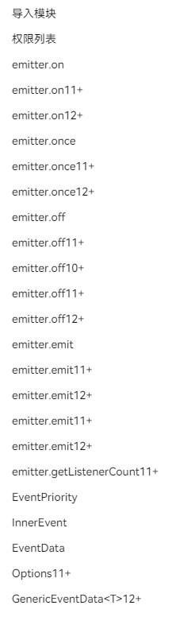


- 测试Demo接口

```java
//1. 持续订阅指定的事件，并在接收到该事件时，执行对应的回调处理函数。
let innerEvent: emitter.InnerEvent = {
  eventId: 1
};
// 收到eventId为1的事件后执行回调函数
emitter.on(innerEvent, () => {
  console.info('callback');
});

// 2.发送指定的事件。
let eventData: emitter.EventData = {
  data: {
    "content": "content",
    "id": 1,
  }
};
console.info("emitter.emit 1");
emitter.emit("eventId", eventData);

//3. 取消eventID为1的所有事件回调处理函数
emitter.off(1);

//4.次订阅指定的事件，并在接收到该事件并执行完相应的回调函数后，自动取消订阅。
emitter.once(innerEvent, () => {
  console.info('once callback');
});

//5.发送指定的事件。
console.info("emitter.emit 2");
emitter.emit("eventId", eventData);

```

---

# 其他

## 系统时间时区

本模块主要由系统时间和系统时区功能组成。开发者可以设置、获取系统时间及系统时区。

https://developer.huawei.com/consumer/cn/doc/harmonyos-references-V5/js-apis-date-time-V5

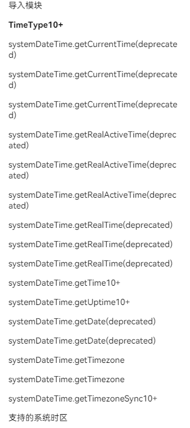


- 测试Demo接口

```java
//1.使用同步方式获取自Unix纪元以来经过的时间
try {
  let time = systemDateTime.getTime(true)
  console.info("systemDateTimeDemo time:" + JSON.stringify(time));
} catch(e) {
  let error = e as BusinessError;
  console.info(`Failed to get time. message: ${error.message}, code: ${error.code}`);
}

//2.使用同步方式获取自系统启动以来经过的时间。
try {
  let time = systemDateTime.getUptime(systemDateTime.TimeType.ACTIVE, false);
  console.info("systemDateTimeDemo time:" + JSON.stringify(time));
} catch(e) {
  let error = e as BusinessError;
  console.info(`Failed to get uptime. message: ${error.message}, code: ${error.code}`);
}

//3.获取系统时区，使用callback异步回调。
try {
  systemDateTime.getTimezone((error: BusinessError, data: string) => {
    if (error) {
      console.info(`Failed to get timezone. message: ${error.message}, code: ${error.code}`);
      return;
    }
    console.info(`Succeeded in get timezone : ${data}`);;
  });
} catch(e) {
  let error = e as BusinessError;
  console.info(`Failed to get timezone. message: ${error.message}, code: ${error.code}`);
}

//4.获取系统时区，使用Promise异步回调。
try {
  systemDateTime.getTimezone().then((data: string) => {
    console.info(`Succeeded in getting timezone: ${data}`);
  }).catch((error: BusinessError) => {
    console.info(`Failed to get timezone. message: ${error.message}, code: ${error.code}`);
  });
} catch(e) {
  let error = e as BusinessError;
  console.info(`Failed to get timezone. message: ${error.message}, code: ${error.code}`);
}

```

---

## 壁纸

壁纸管理服务为HarmonyOS系统服务，提供壁纸切换功能。

从API 9开始壁纸管理的接口调整为系统API，壁纸的切换只能通过系统应用来完成。壁纸管理提供壁纸切换通道，使用壁纸的应用（如：桌面）需订阅壁纸变化通知并刷新壁纸显示。

https://developer.huawei.com/consumer/cn/doc/harmonyos-references-V5/js-apis-wallpaper-V5

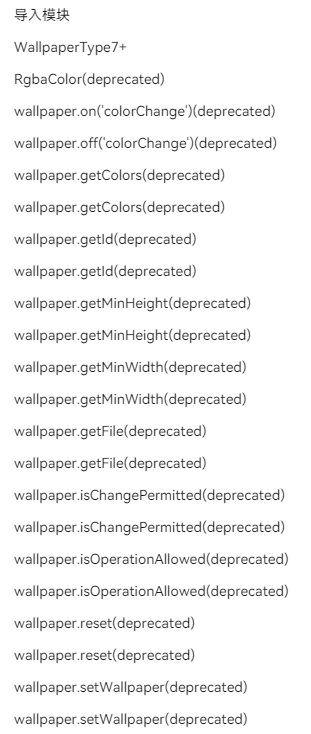


- 测试Demo接口

```java
wallpaper.getId(wallpaper.WallpaperType.WALLPAPER_SYSTEM, (error: BusinessError, data: Number) => {
    if (error) {
    console.error(`failed to getId because: ${JSON.stringify(error)}`);
    return;
    }
    console.log(`success to getId: ${JSON.stringify(data)}`);
});
```

---

## 设置数据项名称

本模块提供访问设置数据项的能力。

有一点android settingsprovider的感觉

https://developer.huawei.com/consumer/cn/doc/harmonyos-references-V5/js-apis-settings-V5

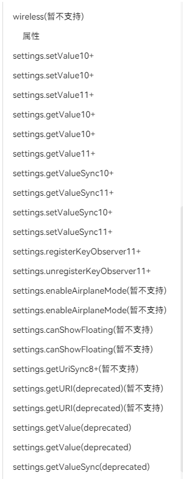


- 测试Demo接口

```java
//1.获取数据库中指定数据项的值。使用callback异步回调。
const context: Context =  getContext();
settings.getValue(context, settings.display.SCREEN_BRIGHTNESS_STATUS, (err, value) => {
  if (err) {
    console.error(`Failed to get the setting. ${err.message} `);
    return;
  }
  console.log(`callback:value -> ${JSON.stringify(value)}`)
});

//2.获取数据库中指定数据项的值。使用Promise异步回调。
settings.getValue(context, settings.display.SCREEN_BRIGHTNESS_STATUS).then((value) => {
  console.log(`promise:value -> ${JSON.stringify(value)}`)
});

//3.用于在指定上下文中注册一个观察者，以便于在指定域名中观察指定的域名。
// 当该键值发生变化时，将调用注册的回调函数，如果成功注册则返回true，否则返回false。
settings.registerKeyObserver(context, settings.display.SCREEN_BRIGHTNESS_STATUS, settings.domainName.DEVICE_SHARED, (err, val) => {
  if (err) {
    console.error(`Failed to get the setting. ${err.message} `);
    return;
  }
  console.log(`callback:value -> ${JSON.stringify(val)}`)
  let value:string = settings.getValueSync(context, settings.display.SCREEN_BRIGHTNESS_STATUS, '10');
  console.log(`Promise:value -> ${value}`);
});

//4.将数据项名称及数据项的值保存到数据库中，使用callback异步回调。
settings.setValue(context, settings.display.SCREEN_BRIGHTNESS_STATUS, '100', (status) => {
  console.log('Callback return whether value is set status:' + status);
});

```

---

# 运行效果

<div align="center"> 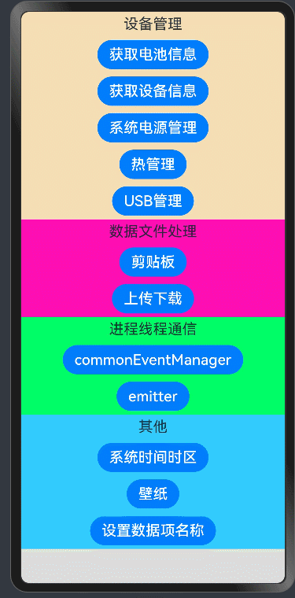 </div>

---

# 参考资料

1.Basic Services Kit简介

https://developer.huawei.com/consumer/cn/doc/harmonyos-guides-V5/basic-services-kit-overview-V5

2.Basic Services Kit（基础服务）

https://developer.huawei.com/consumer/cn/doc/harmonyos-references-V5/basic-services-arkts-V5

---

# Demo源码

Demo:

基于SDK 12(5.0.0)版本，完成调试，可以运行。

BatteryInfoDemo.rar

---

# 结束语

当你自己对着官方文档，将此demo跑起来过一篇后，至此，基本上harmonyOS应用开发我们可以说是入门了。

后面我们其实就是针对新需求，不断的搜索资料，调试接口，总结提升的一个过程了。

恭喜你自己吧！


---

[<font face='黑体' color=#ff0000 size=40 >跳转到文章开始</font>](#鸿蒙开发从零开始之Basic_Services_Kit)

---


---

