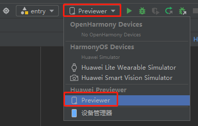
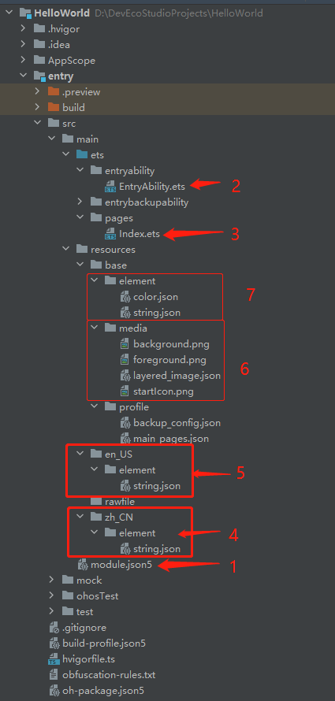
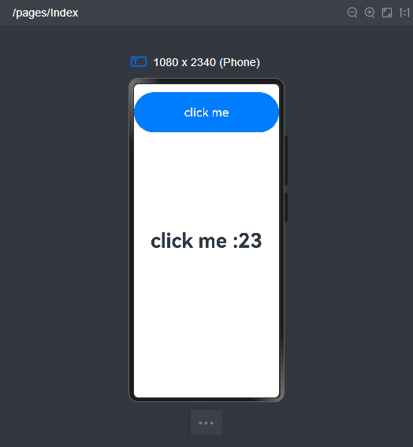

# 鸿蒙开发从零开始之HelloWorld


---

老规矩，第一篇文章就是Helloworld，以完成开发环境的配置，鸿蒙开发的基础入门。

# 必备

你需要且只需要一台PC电脑；


# 前期准备


(1)打开鸿蒙开发官方网址：

https://developer.huawei.com/consumer/cn/develop

(2)下载鸿蒙集成开发环境(IDE) DevEco Studio：

https://developer.huawei.com/consumer/cn/deveco-studio/

我下载的版本是：

DevEco Studio NEXT Developer Beta1

Build #DS-233.14475.28.36.503403

构建版本：5.0.3.403, built on June 20, 2024


(3)正常安装DevEco Studio：


(4)阅读鸿蒙开发快速入门二篇官方文档：

- 开发准备

https://developer.huawei.com/consumer/cn/doc/harmonyos-guides-V5/start-overview-V5

- 构建第一个ArkTS应用（Stage模型） 

https://developer.huawei.com/consumer/cn/doc/harmonyos-guides-V5/start-with-ets-stage-V5


(5)按照鸿蒙开发快速入门二篇官方文档，完成HelloWorld的开发和运行，查看效果。

备注：

如果我们没有鸿蒙设备，我们选择在模拟器上运行Demo：



---


# 项目的目录结构介绍





1.module.json5

模块配置文件。
主要包含HAP包的配置信息、应用/服务在具体设备上的配置信息以及应用/服务的全局配置信息。

--类似android系统的AndroidManifest.xml

2.entryability.ets

应用/服务的入口

--类似android系统的Activity.java

3.Index.ets

应用/服务包含的页面

--类似android系统的xml布局文件

4.resources/zh_CN

中文字符串

--类似android系统的中文字符串


5.resources/en_US

英文字符串

--类似android系统的英文字符串

6.resources/base/media

多媒体资源，包括图片等

--类似android系统的drawable资源

7.resources/base/element

其他资源，包括color等

--类似android系统的value目录下的资源

---

# HelloWorld 显示效果

界面显示一个Button，一个Text，点击一次Button，Text显示点击Button次数；





# Index.ets--界面显示文件

```java
import { hilog } from '@kit.PerformanceAnalysisKit';

@Entry
@Component
struct Index {
  @State message: string = 'Hello World';

  @State num: number = 0 //点击Button次数

  build() {
    RelativeContainer() {
      Text(this.message)//显示点击Button次数的Text
        .id('HelloWorld')
        .fontSize(50)
        .fontWeight(FontWeight.Bold)
        .alignRules({
          center: { anchor: '__container__', align: VerticalAlign.Center },
          middle: { anchor: '__container__', align: HorizontalAlign.Center }
        })
      Divider()
      //Button(`click me num 的值为：${this.num}`)
      Button(`click me`)//Button组件
        .onClick(()=>{//Button click方法
          this.num =  this.num + 1
          this.message='click me :'.toString() + this.num.toString() //调整点击Button次数显示
        })
        .height(100)
        .width('100%')
        .fontSize(30)
        .margin({top:20})
    }
    .height('100%')
    .width('100%')
  }
}
```

---

# 小结


# 参考资料

1.鸿蒙开发官方网址：

https://developer.huawei.com/consumer/cn/develop


---


