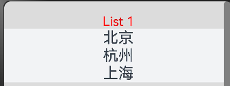
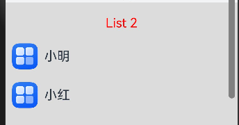
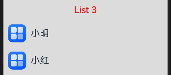
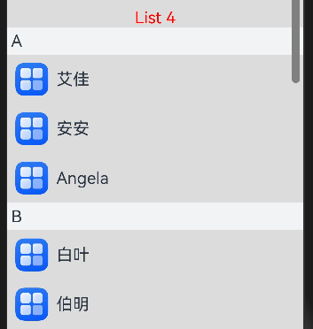
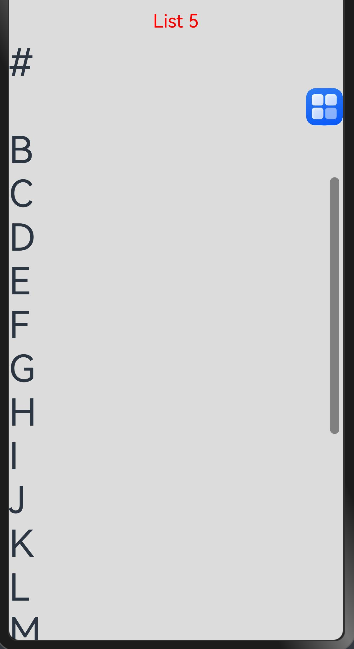
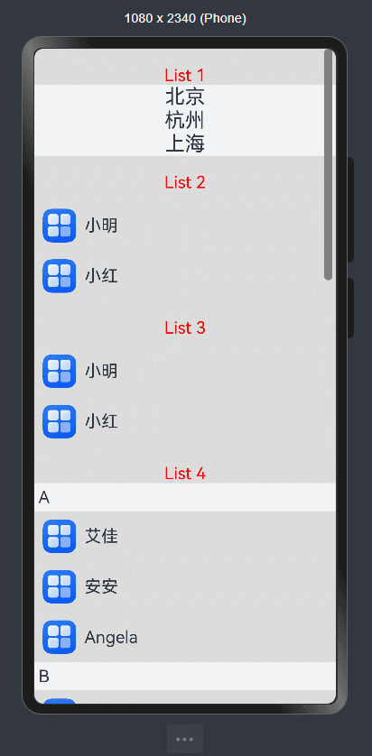

# 鸿蒙开发从零开始之List


---

这篇文章主要目的是初步学习列表 (List)组件的使用；


基于SDK 12(5.0.0)版本，完成调试，可以运行。


---

# 核心代码


## List 1

```java
//List 1
Text("List 1")
    .fontSize(20)
    .fontColor(Color.Red)
    .margin({top:20})
List() {
    ListItem() {
    Text('北京').fontSize(24)
    }
    ListItem() {
    Text('杭州').fontSize(24)
    }
    ListItem() {
    Text('上海').fontSize(24)
    }
}
.backgroundColor('#FFF1F3F5')
.alignListItem(ListItemAlign.Center)
```

---

UI显示效果：




---

## List 2

```java
//List 2
Text("List 2")
    .fontSize(20)
    .fontColor(Color.Red)
    .margin({top:20})
List() {
    ListItem() {
    Row() {
        Image($r('app.media.startIcon'))
        .width(40)
        .height(40)
        .margin(10)
        Text('小明')
        .fontSize(20)
    }
    }
    ListItem() {
    Row() {
        Image($r('app.media.startIcon'))
        .width(40)
        .height(40)
        .margin(10)
        Text('小红')
        .fontSize(20)
    }
    }
}
.margin({top:10})
```

---

UI显示效果：



---

## List 3

```java
class Contact {
  key: string = util.generateRandomUUID(true);
  name: string;
  icon: Resource;

  constructor(name: string, icon: Resource) {
    this.name = name;
    this.icon = icon;
  }
}
...

private contacts: Array<object> = [
new Contact('小明', $r("app.media.startIcon")),
new Contact('小红', $r("app.media.startIcon")),
]
...
//List 3
Text("List 3")
    .fontSize(20)
    .fontColor(Color.Red)
    .margin({top:20})
List() {
    ForEach(this.contacts, (item: Contact) => {
    ListItem() {
        Row() {
        Image(item.icon)
            .width(40)
            .height(40)
            .margin(10)
        Text(item.name).fontSize(20)
        }
        .width('100%')
        .justifyContent(FlexAlign.Start)
    }
    }, (item: Contact) => JSON.stringify(item))
}
.margin({top:10})
```

---

UI显示效果：




---

## List 4

```java
class ContactsGroup {
  title: string = ''
  contacts: Array<object> | null = null
  key: string = ""
}

export let contactsGroups: object[] = [
  {
    title: 'A',
    contacts: [
      new Contact('艾佳', $r('app.media.startIcon')),
      new Contact('安安', $r('app.media.startIcon')),
      new Contact('Angela', $r('app.media.startIcon')),
    ],
    key: util.generateRandomUUID(true)
  } as ContactsGroup,
  {
    title: 'B',
    contacts: [
      new Contact('白叶', $r('app.media.startIcon')),
      new Contact('伯明', $r('app.media.startIcon')),
    ],
    key: util.generateRandomUUID(true)
  } as ContactsGroup,
// ...
]
...

// 定义分组联系人数据集合contactsGroups数组
@Builder itemHead(text: string) {
// 列表分组的头部组件，对应联系人分组A、B等位置的组件
Text(text)
    .fontSize(20)
    .backgroundColor('#fff1f3f5')
    .width('100%')
    .padding(5)
}

...

//List 4
Text("List 4")
    .fontColor(Color.Red)
    .fontSize(20)
    .margin({top:20})
List() {
    // 循环渲染ListItemGroup，contactsGroups为多个分组联系人contacts和标题title的数据集合
    ForEach(contactsGroups, (itemGroup: ContactsGroup) => {
    ListItemGroup({ header: this.itemHead(itemGroup.title) }) {
        // 循环渲染ListItem
        if (itemGroup.contacts) {
        ForEach(itemGroup.contacts, (item: Contact) => {
            ListItem() {
            Row() {
                Image(item.icon)
                .width(40)
                .height(40)
                .margin(10)
                Text(item.name).fontSize(20)
            }
            .width('100%')
            .justifyContent(FlexAlign.Start)
            }
        }, (item: Contact) => JSON.stringify(item))
        }
    }
    }, (itemGroup: ContactsGroup) => JSON.stringify(itemGroup))
}.sticky(StickyStyle.Header)  // 设置吸顶，实现粘性标题效果

```

---

UI显示效果：




---

## List 5

```java
  @State alphabets: Array<string> = ['#', 'A', 'B', 'C', 'D', 'E', 'F', 'G', 'H', 'I', 'J', 'K',
  'L', 'M', 'N', 'O', 'P', 'Q', 'R', 'S', 'T', 'U', 'V', 'W', 'X', 'Y', 'Z'];
...
@Builder itemEnd(index: number) {
// 构建尾端滑出组件
Button({ type: ButtonType.Circle }) {
    Image($r('app.media.startIcon'))
    .width(40)
    .height(40)
}
.onClick(() => {
    // this.messages为列表数据源，可根据实际场景构造。点击后从数据源删除指定数据项。
    this.alphabets.splice(index, 1);
})
}
...

//List 5
Text("List 5")
    .fontSize(20)
    .fontColor(Color.Red)
    .margin({top:20})
List() {
    ForEach(this.alphabets, (item: string) => {
    ListItem() {
        Row() {
        Text(item).fontSize(40)
        }
        .width('100%')
        .justifyContent(FlexAlign.Start)
    }
    .swipeAction({
        end: {
        // index为该ListItem在List中的索引值。
        builder: () => { this.itemEnd(0) },
        }
    }) // 设置侧滑属性.
    }, (item: string) => JSON.stringify(item))
}
.margin({top:10})

```

---

UI显示效果：




---


# 效果为：

<div align="center">  </div>


---

# 小结


---

# 参考资料

1.创建列表 (List)

https://developer.huawei.com/consumer/cn/doc/harmonyos-guides-V5/arkts-layout-development-create-list-V5

---

# Demo源码

ListDemo.rar

---

[<font face='黑体' color=#ff0000 size=40 >跳转到文章开始</font>](#鸿蒙开发从零开始之List)

---


---

