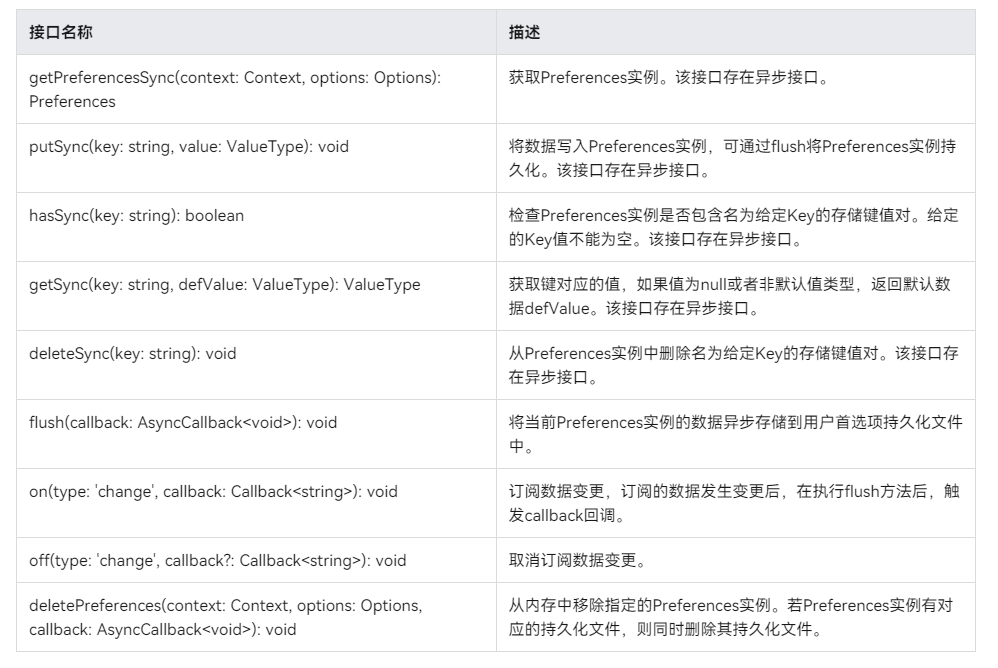
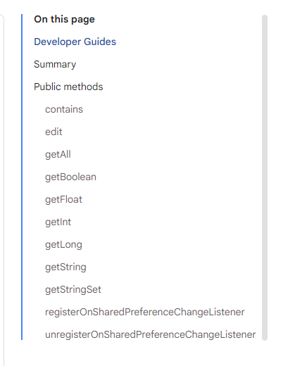

# 鸿蒙开发从零开始之Preferences

---

Preferences,用户首选项实现数据持久化，主要功能是：

为应用提供Key-Value键值型的数据处理能力，支持应用持久化轻量级数据，并对其修改和查询。

类似android SharedPreferences.

---

# 建议

- 1.阅读通过用户首选项实现数据持久化

通过用户首选项实现数据持久化:

https://developer.huawei.com/consumer/cn/doc/harmonyos-guides-V5/data-persistence-by-preferences-V5

 - 2.绝知此事要躬行
 
 自己写一个Demo，验证文档中的属性。

 ---

# Preferences的接口和SharedPreferences的接口

## Preferences api

## android SharedPreferences api

 ---

 # Demo

## 导入@kit.ArkData模块

    import { preferences } from '@kit.ArkData';
    import { util } from '@kit.ArkTS';
    import { BusinessError } from '@kit.BasicServicesKit';

## 获取Preferences实例

Stage模型：

    //1.定义Preferences变量
    let dataPreferences: preferences.Preferences | null = null;
    //2.初始化preferences
    let options: preferences.Options = { name: 'myStore' };
    dataPreferences = preferences.getPreferencesSync(this.context, options);

---

## 读取数据-getSync

    //3.读取数据
    let val = dataPreferences.getSync('startup', 'default');
    console.info("first read The 'startup' value is " + val);
    // 当获取的值为带有特殊字符的字符串时，需要将获取到的Uint8Array转换为字符串
    let uInt8Array2 : preferences.ValueType = dataPreferences.getSync('uInt8', new Uint8Array(0));
    let textDecoder = util.TextDecoder.create('utf-8');
    val = textDecoder.decodeWithStream(uInt8Array2 as Uint8Array);
    console.info("first read The 'uInt8' value is " + val);

---

## 写入数据-putSync

使用putSync()方法保存数据到缓存的Preferences实例中。在写入数据后，如有需要，可使用flush()方法将Preferences实例的数据存储到持久化文件。

    //4.写入数据
    if (dataPreferences.hasSync('startup')) {
      console.info("The key 'startup' is contained.");
      console.info("The key 'startup' does not contain.");
      // 此处以此键值对存在时写入数据为例
      dataPreferences.putSync('startup', 'auto_data');
      // 当字符串有特殊字符时，需要将字符串转为Uint8Array类型再存储
      //let uInt8Array1 = new util.TextEncoder().encodeInto("~！@#￥%……&*（）——+？");
      let uInt8Array1 = new util.TextEncoder().encodeInto("uInt8_test");
      dataPreferences.putSync('uInt8', uInt8Array1);
      console.info("write data to Preferences.");
    } else {
      console.info("The key 'startup' does not contain.");
      // 此处以此键值对不存在时写入数据为例
      dataPreferences.putSync('startup', 'auto_data');
      // 当字符串有特殊字符时，需要将字符串转为Uint8Array类型再存储
      //let uInt8Array1 = new util.TextEncoder().encodeInto("~！@#￥%……&*（）——+？");
      let uInt8Array1 = new util.TextEncoder().encodeInto("uInt8_test");
      dataPreferences.putSync('uInt8', uInt8Array1);
      console.info("write data to Preferences.");
    }

---

## 数据持久化-flush

    dataPreferences.flush((err: BusinessError) => {
    if (err) {
        console.error(`Failed to flush. Code:${err.code}, message:${err.message}`);
        return;
    }
    console.info('Succeeded in flushing.');
    })

---

## 订阅数据变更

应用订阅数据变更需要指定observer作为回调方法。订阅的Key值发生变更后，当执行flush()方法时，observer被触发回调。

    //7.订阅数据变更
    let observer = (key: string) => {
      console.info('observer The key ' + key + ' changed.');
    }
    dataPreferences.on('change', observer);

    // 数据产生变更，由'auto'变为'manual_demo'
    dataPreferences.put('startup', 'manual_test', (err: BusinessError) => {
      if (err) {
        console.error(`Failed to put the value of 'startup'. Code:${err.code},message:${err.message}`);
        return;
      }
      console.info("Succeeded in putting the value of 'startup'.");
      if (dataPreferences !== null) {
        dataPreferences.flush((err: BusinessError) => {
          if (err) {
            console.error(`Failed to flush. Code:${err.code}, message:${err.message}`);
            return;
          }
          console.info('Succeeded in flushing.');
        })
      }
    })

---

## 删除字段数据-deleteSync

使用deleteSync()方法删除指定键值对。

    dataPreferences.deleteSync('startup');

---

## 删除指定文件-deletePreferences

使用deletePreferences()方法从内存中移除指定文件对应的Preferences实例，包括内存中的数据。若该Preference存在对应的持久化文件，则同时删除该持久化文件，包括指定文件及其备份文件、损坏文件。

    preferences.deletePreferences(this.context, options, (err: BusinessError) => {
    if (err) {
        console.error(`Failed to delete preferences. Code:${err.code}, message:${err.message}`);
        return;
    }
    console.info('Succeeded in deleting preferences.');
    })

---

# 日志显示

模拟器输出日志显示：

    1.Ability onCreate 日志
    Ability onCreate
    Ability onWindowStageCreate
    2.读取字段startup值
    first read The 'startup' value is manual_test
    3.模拟器读取带有特殊字符的字符串时异常
    The TextDecoder.create interface in the Previewer is a mocked implementation and may behave differently than on a real device.
    The TextDecoder.constructor interface in the Previewer is a mocked implementation and may behave differently than on a real device.
    The TextDecoder.decodeWithStream interface in the Previewer is a mocked implementation and may behave differently than on a real device.
    first read The 'uInt8' value is
    The key 'startup' is contained.
    The key 'startup' does not contain.
    The TextEncoder.constructor interface in the Previewer is a mocked implementation and may behave differently than on a real device.
    The TextEncoder.encodeInto interface in the Previewer is a mocked implementation and may behave differently than on a real device.
    4.写值
    write data to Preferences.
    Ability onForeground
    Succeeded in loading the content.
    5.flush值成功
    Succeeded in flushing.
    6.第二次读取字段startup
    second read The 'startup' value is manual_test
    7.第二次模拟器读取带有特殊字符的字符串时异常
    The TextDecoder.create interface in the Previewer is a mocked implementation and may behave differently than on a real device.
    The TextDecoder.constructor interface in the Previewer is a mocked implementation and may behave differently than on a real device.
    The TextDecoder.decodeWithStream interface in the Previewer is a mocked implementation and may behave differently than on a real device.
    second read The 'uInt8' value is
    Succeeded in putting the value of 'startup'.
    8.内容改变监听成功
    observer The key startup changed.
    Succeeded in flushing.

---

# 核心代码

[EntryAbility.ets](./EntryAbility.ets)

---

# 小结

- 确认鸿蒙系统与android系统的相似之处

鸿蒙系统Preferences和android系统的SharedPreferences，整体来说设计是极其类似的。

这个原因是可能是各个系统的xml数据是基本基础，都是大同小异的。

前面布局相似，我能理解，但是这个数据设计也是太相似了，让人有点心生疑惑啊，为什么这么像？？？

- 确认鸿蒙系统与android系统的不同之处

属性的接口是不同的；

- 比较鸿蒙系统与android系统的优劣势

当前还无结论；

- 回答一下鸿蒙系统到底是不是android系统的套皮疑惑？

当前还无结论；

但是在这个Preferences的设计，确实是一个让人怀疑，鸿蒙系统是一个高度模仿或抄袭android系统的SharedPreferences，也就是是说鸿蒙系统是android系统的套皮。

当然，我们不能仅从这一个点得出这个结论，还需要继续深入学习，特别是从应用到系统层，加油。

---

# 参考资料

1.通过用户首选项实现数据持久化

https://developer.huawei.com/consumer/cn/doc/harmonyos-guides-V5/data-persistence-by-preferences-V5

2.android SharedPreferences

https://developer.android.google.cn/reference/kotlin/android/content/SharedPreferences?hl=en

---

# Demo源码

---

[跳转到文章开始](#鸿蒙开发从零开始之Preferences)

---

---

