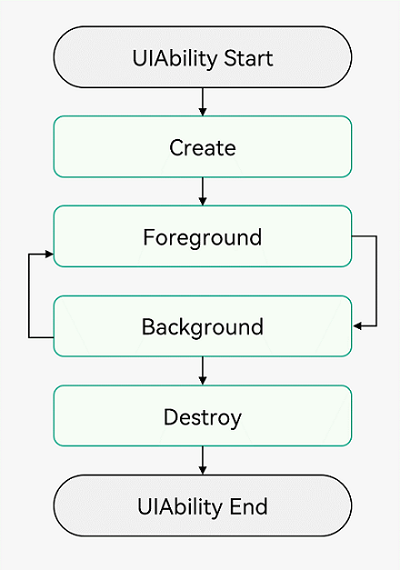
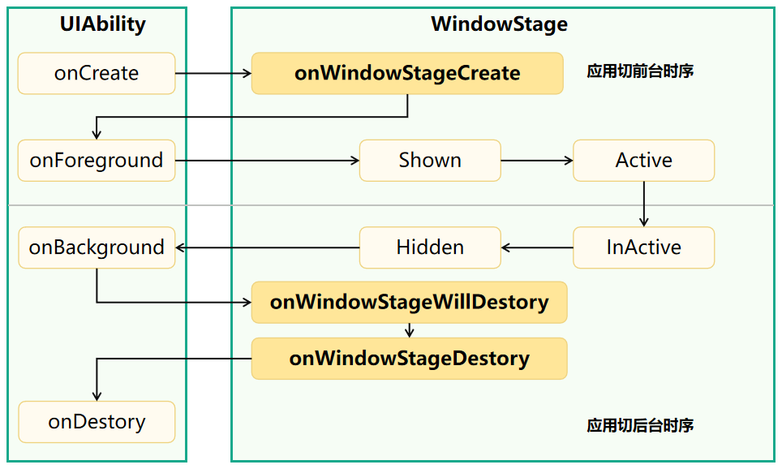

# 鸿蒙开发从零开始之UIAbility浅析


---


[跳转到readme](https://github.com/hfreeman2008/Harmony-from-zero/blob/main/README.md)

---


这篇文章主要目的是初步学习Ability Kit（程序框架服务）的UIAbility组件；

对比android开发中的Activity，UIAbility我们需要了解其生命周期的接口。

---

# UIAbility组件生命周期

查看UIAbility组件生命周期的官方文档：

https://developer.huawei.com/consumer/cn/doc/harmonyos-guides-V5/uiability-lifecycle-V5


类似android开发，UIAbility的生命周期包括Create、Foreground、Background、Destroy四个状态。


## UIAbility组件生命周期图一：

<div align="center">  </div>


## UIAbility组件生命周期图二：

<div align="center">  </div>


对比android Activity的生命周期回调方法和流程，可以清楚的弄明白UIAbility组件生命周期。

## UIAbility的api

因为UIAbility的api有一定的调整，我们需要查看UIAbility的api官方文档，确认对应api的具体信息：

https://developer.huawei.com/consumer/cn/doc/harmonyos-references-V5/js-apis-app-ability-uiability-V5

备注：
鸿蒙的官方文档还是非常的详细和友好，基本上想要的，都能找到。

赞一下。

---


# 核心代码


EntryAbility.ets


```java
import { AbilityConstant, UIAbility, Want } from '@kit.AbilityKit';
import { hilog } from '@kit.PerformanceAnalysisKit';
import { window } from '@kit.ArkUI';
import { BusinessError } from '@kit.BasicServicesKit';

const TAG: string = '[EntryAbility]';
const DOMAIN_NUMBER: number = 0xFF00;

export default class EntryAbility extends UIAbility {

  windowStage: window.WindowStage | undefined = undefined;

  onCreate(want: Want, launchParam: AbilityConstant.LaunchParam): void {
    hilog.info(0x0000, TAG, '%{public}s', 'Ability onCreate');
  }

  onDestroy(): void {
    hilog.info(0x0000, TAG, '%{public}s', 'Ability onDestroy');
    // 系统资源的释放、数据的保存等
  }

  onWindowStageCreate(windowStage: window.WindowStage): void {
    // Main window is created, set main page for this ability
    hilog.info(0x0000, TAG, '%{public}s', 'Ability onWindowStageCreate');

    // 设置WindowStage的事件订阅（获焦/失焦、可见/不可见）
    this.windowStage = windowStage;

    try {
      windowStage.on('windowStageEvent', (data) => {
        let stageEventType: window.WindowStageEventType = data;
        hilog.info(0x0000, TAG, '%{public}s', 'stageEventType.' + stageEventType);
        switch (stageEventType) {
          case window.WindowStageEventType.SHOWN: // 切到前台
            //console.info('windowStage foreground.');
            hilog.info(0x0000, TAG, '%{public}s', 'windowStage foreground.');
            break;
          case window.WindowStageEventType.ACTIVE: // 获焦状态
            //console.info('windowStage active.');
            hilog.info(0x0000, TAG, '%{public}s', 'windowStage active.');
            break;
          case window.WindowStageEventType.INACTIVE: // 失焦状态
            //console.info('windowStage inactive.');
            hilog.info(0x0000, TAG, '%{public}s', 'windowStage inactive.');
            break;
          case window.WindowStageEventType.HIDDEN: // 切到后台
            //console.info('windowStage background.');
            hilog.info(0x0000, TAG, '%{public}s', 'windowStage background.');
            break;
          default:
            break;
        }
      });
    } catch (exception) {
      console.error('Failed to enable the listener for window stage event changes. Cause:' + JSON.stringify(exception));
    }

    // 设置UI加载
    windowStage.loadContent('pages/Index', (err) => {
      if (err.code) {
        hilog.error(0x0000, TAG, 'Failed to load the content. Cause: %{public}s', JSON.stringify(err) ?? '');
        return;
      }
      hilog.info(0x0000, TAG, 'Succeeded in loading the content.');
    });
  }

  onNewWant(want: Want, launchParam: AbilityConstant.LaunchParam): void {
    super.onNewWant(want, launchParam);
    hilog.info(0x0000, TAG, '%{public}s', 'Ability onNewWant');
    // 更新资源、数据
  }

  onWindowStageDestroy(): void {
    // Main window is destroyed, release UI related resources
    hilog.info(0x0000, TAG, '%{public}s', 'Ability onWindowStageDestroy');
    // 释放UI资源
    // 例如在onWindowStageDestroy()中注销获焦/失焦等WindowStage事件
    try {
      if (this.windowStage) {
        this.windowStage.off('windowStageEvent');
      }
    } catch (err) {
      let code = (err as BusinessError).code;
      let message = (err as BusinessError).message;
      hilog.error(DOMAIN_NUMBER, TAG, `Failed to disable the listener for windowStageEvent. Code is ${code}, message is ${message}`);
    }
  }


  onForeground(): void {
    // Ability has brought to foreground
    hilog.info(0x0000, TAG, '%{public}s', 'Ability onForeground');
    // 申请系统需要的资源，或者重新申请在onBackground()中释放的资源

  }

  onBackground(): void {
    // Ability has back to background
    hilog.info(0x0000, TAG, '%{public}s', 'Ability onBackground');
    // 释放UI不可见时无用的资源，或者在此回调中执行较为耗时的操作
    // 例如状态保存等

  }

  onWindowStageWillDestroy(windowStage: window.WindowStage): void {
    super.onWindowStageWillDestroy(windowStage);
    hilog.info(0x0000, TAG, '%{public}s', 'Ability onWindowStageWillDestroy');
    // 释放通过windowStage对象获取的资源

  }

  onWindowStageRestore(windowStage: window.WindowStage): void {
    super.onWindowStageRestore(windowStage);
    hilog.info(0x0000, TAG, '%{public}s', 'Ability onWindowStageRestore');
  }

  onBackPressed(): boolean {
    hilog.info(0x0000, TAG, '%{public}s', 'Ability onBackPressed');
    return super.onBackPressed();
  }
}

```

---

# 启动时的log信息

```java
07-13 16:01:32.613   45180-37992  A00000/[EntryAbility]         I     Ability onCreate
07-13 16:01:32.615   45180-37992  A00000/[EntryAbility]         I     Ability onWindowStageCreate
07-13 16:01:32.615   45180-37992  A00000/[EntryAbility]         I     Ability onForeground
07-13 16:01:32.703   45180-37992  A00000/[EntryAbility]         I     Succeeded in loading the content.

```

可以看出，启动界面显示的调用顺序为：

```java
onCreate  -- onWindowStageCreate -- onForeground
```

与官方文档是一致的。


---

# 小结


- 确认鸿蒙系统与android系统的相似之处

这个生命周期，鸿蒙系统与android系统不能说完成一模一样，但是相似度确实是非常高啊；

这对于android开发者来说，是非常友好的，学习成本不高。


- 确认鸿蒙系统与android系统的不同之处

整体来说生命周期差不多的，但是鸿蒙系统中的生命周期涉及到一个新的对象WindowStage，需要关注。


- 比较鸿蒙系统与android系统的优劣势

当前还无结论；


- 回答一下鸿蒙系统到底是不是android系统的套皮疑惑？

当前还无结论；

---

# 参考资料

1.UIAbility组件：

https://developer.huawei.com/consumer/cn/doc/harmonyos-guides-V5/4_2uiability_u7ec4_u4ef6-V5

2.UIAbility组件生命周期

https://developer.huawei.com/consumer/cn/doc/harmonyos-guides-V5/uiability-lifecycle-V5

3.uiability的api官方文档

https://developer.huawei.com/consumer/cn/doc/harmonyos-references-V5/js-apis-app-ability-uiability-V5

---

# Demo源码

UIAbilityDemo03.rar

---

[<font face='黑体' color=#ff0000 size=40 >跳转到文章开始</font>](#鸿蒙开发从零开始之UIAbility浅析)

---


---

