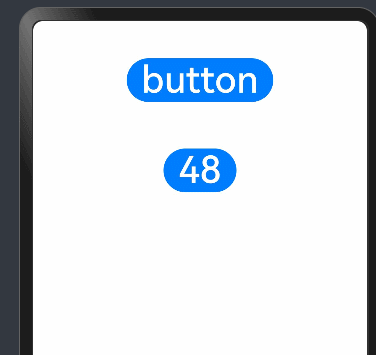

# 鸿蒙开发从零开始之UIAbility组件与UI的数据同步


---


[跳转到readme](https://github.com/hfreeman2008/Harmony-from-zero/blob/main/README.md)

---

[<font face='黑体' color=#ff0000 size=40 >跳转到文章结尾</font>](#Demo源码)

---

这篇文章主要目的是了解UIAbility组件与UI的数据同步的方法；

---


# UIAbility组件与UI的数据同步

基于当前的应用模型，可以通过以下几种方式来实现UIAbility组件与UI之间的数据同步。

- 使用EventHub进行数据通信：

在基类Context中提供了EventHub对象，可以通过发布订阅方式来实现事件的传递。在事件传递前，订阅者需要先进行订阅，当发布者发布事件时，订阅者将接收到事件并进行相应处理。

- 使用AppStorage/LocalStorage进行数据同步：

ArkUI提供了AppStorage和LocalStorage两种应用级别的状态管理方案，可用于实现应用级别和UIAbility级别的数据同步。

---

# 两个UIAbility之间可通过哪些方法实现数据传递

两个UIAbility之间数据传递的方法如下，推荐优先使用排序靠前的方法。

- 方法一：调用startAbility接口启动另外一个UIAbility时，通过wantInfo添加启动参数。也可通过startAbilityForResult接口，获取被调用方UIAbility在关闭时返回的信息。
- 方法二：使用应用级别的状态管理AppStorage、PersistentStorage、Environment，实现应用级或者多个页面的状态数据共享。
- 方法三：同一个应用中UIAbility和UIAbility之间的数据传递，可以使用AppStorage/LocalStorage进行数据同步。
- 方法四：使用线程间通信工具Emitter、Worker进行通信。
- 方法五：使用进程间通信工具CES（公共事件服务）进行通信。
- 其他方法（系统应用）：通过Call调用实现UIAbility交互。


---

# EventHub


使用EventHub进行数据通信

EventHub为UIAbility组件提供了事件机制，使它们能够进行订阅、取消订阅和触发事件等数据通信能力。


## 关键代码


在EntryAbility中：

```java
onCreate(want: Want, launchParam: AbilityConstant.LaunchParam): void {
    hilog.info(0x0000, 'testTag', '%{public}s', 'Ability onCreate');

    //1.订阅指定事件
    let eventhub = this.context.eventHub;
    //2.执行订阅操作
    eventhub.on('event1', this.eventFunc);
    eventhub.on('event1', (data: string) => {
        hilog.info(0x0000, 'testTag', '%{public}s', 'data：' + JSON.stringify(data));
    });

}
//订阅回调接口
eventFunc(argOne: Context, argTwo: Context): void {
    hilog.info(DOMAIN_NUMBER, TAG, '=========eventFunc:' + `${argOne}, ${argTwo}`);
return;
}


onDestroy(): void {
    hilog.info(0x0000, 'testTag', '%{public}s', 'Ability onDestroy');
    //3.调用eventHub.off()方法取消该事件的订阅
    this.context.eventHub.off('event1');
}
```


```java
//Index.ets

  private context = getContext(this) as common.UIAbilityContext;
  eventHubFunc(): void {
    console.log("eventHubFunc");
    // emit不带参数触发自定义“event1”事件
    this.context.eventHub.emit('event1');
    // emit带1个参数触发自定义“event1”事件
    this.context.eventHub.emit('event1', 1);
    // emit带2个参数触发自定义“event1”事件
    this.context.eventHub.emit('event1', 2, 'test');
  }


  build() {
    Column() {

      Button('button')
        .fontSize(40)
        .margin({top:40,bottom:10})
        .onClick(() => {
          console.log("click");
          //4 emit 触发指定事件。
          this.eventHubFunc();
        }
        )
```


---

# PersistentStorage

PersistentStorage是应用程序中的可选单例对象。此对象的作用是持久化存储选定的AppStorage属性，以确保这些属性在应用程序重新启动时的值与应用程序关闭时的值相同。

PersistentStorage将选定的AppStorage属性保留在设备磁盘上。应用程序通过API，以决定哪些AppStorage属性应借助PersistentStorage持久化。UI和业务逻辑不直接访问PersistentStorage中的属性，所有属性访问都是对AppStorage的访问，AppStorage中的更改会自动同步到PersistentStorage。

PersistentStorage和AppStorage中的属性建立双向同步。应用开发通常通过AppStorage访问PersistentStorage，另外还有一些接口可以用于管理持久化属性，但是业务逻辑始终是通过AppStorage获取和设置属性的。


## 关键代码

PersistentStorage和UI实例相关联，持久化操作需要在UI实例初始化成功后（即loadContent传入的回调被调用时）才可以被调用，早于该时机调用会导致持久化失败。


```java
// EntryAbility.ets

  onWindowStageCreate(windowStage: window.WindowStage): void {
    // Main window is created, set main page for this ability
    hilog.info(0x0000, 'testTag', '%{public}s', 'Ability onWindowStageCreate');

    windowStage.loadContent('pages/Index', (err) => {
      if (err.code) {
        hilog.error(0x0000, 'testTag', 'Failed to load the content. Cause: %{public}s', JSON.stringify(err) ?? '');
        return;
      }
      hilog.info(0x0000, 'testTag', 'Succeeded in loading the content.');
    });

    //1.初始化PersistentStorage
    PersistentStorage.persistProp('aProp', 47);
    //2.AppStorage获取对应属性
    let aPropValue = AppStorage.get<number>('aProp');
    hilog.info(0x0000, 'testTag', 'aPropValue:' + aPropValue);
  }
```

```java
//Index.ets

PersistentStorage.persistProp('aProp', 48);

@Entry
@Component
struct Index {

  @StorageLink('aProp') aProp: number = 48

  build() {
    Column() {

        // 应用退出时会保存当前结果。重新启动后，会显示上一次的保存结果
      Button(`${this.aProp}`)
        .onClick(() => {
          this.aProp += 1;
        })
        .fontSize(40)
        .margin({top:40,bottom:10})

```

---

# 运行效果

<div align="center">  </div>

---

# 参考资料

1.两个UIAbility之间可通过哪些方法实现数据传递

https://developer.huawei.com/consumer/cn/doc/harmonyos-faqs-V5/faqs-ability-31-V5

2.UIAbility组件与UI的数据同步

https://developer.huawei.com/consumer/cn/doc/harmonyos-guides-V5/uiability-data-sync-with-ui-V5

3.EventHub

https://developer.huawei.com/consumer/cn/doc/harmonyos-references-V5/js-apis-inner-application-eventhub-V5#eventhubon

4.从AppStorage中访问PersistentStorage初始化的属性

https://developer.huawei.com/consumer/cn/doc/harmonyos-guides-V5/arkts-persiststorage-V5#%E4%BB%8Eappstorage%E4%B8%AD%E8%AE%BF%E9%97%AEpersistentstorage%E5%88%9D%E5%A7%8B%E5%8C%96%E7%9A%84%E5%B1%9E%E6%80%A7

---

# Demo源码

Demo:

基于SDK 12(5.0.0)版本，完成调试，可以运行。

.rar

---


---

[<font face='黑体' color=#ff0000 size=40 >跳转到文章开始</font>](#鸿蒙开发从零开始之UIAbility组件与UI的数据同步)

---


---

