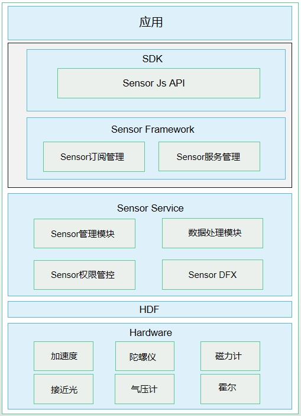

# 鸿蒙开发从零开始之传感器服务


---


[跳转到readme](https://github.com/hfreeman2008/Harmony-from-zero/blob/main/README.md)

---

[<font face='黑体' color=#ff0000 size=40 >跳转到文章结尾</font>](#Demo源码)

---

# 目的

这篇文章主要目的是初步学习Sensor Service Kit（传感器服务）；


# 使用场景

Sensor Service Kit（传感器服务）使应用程序能够从传感器获取原始数据，并提供振感控制能力。

Sensor（传感器）模块是应用访问底层硬件传感器的一种设备抽象概念。开发者可根据传感器提供的相关接口订阅传感器数据，并根据传感器数据定制相应的算法开发各类应用，比如指南针、运动健康、游戏等。

Vibrator（振动）模块最大化开放马达器件能力，通过拓展原生马达服务实现振动与交互融合设计，打造细腻精致的一体化振动体验和差异化体验，提升用户交互效率和易用性、提升用户体验、增强品牌竞争力。


# 传感器类型

| 传感器类型|	描述|	说明|	主要用途|
| -|-|-|-|
ACCELEROMETER |	加速度传感器 |	测量三个物理轴（x、y 和 z）上，施加在设备上的加速度（包括重力加速度），单位 : m/s² |	检测运动状态。|
ACCELEROMETER_UNCALIBRATED |	未校准加速度传感器 |	测量三个物理轴（x、y 和 z）上，施加在设备上的未校准的加速度（包括重力加速度），单位 : m/s²	 | 检测加速度偏差估值。|
| LINEAR_ACCELEROMETER	| 线性加速度传感器 |	测量三个物理轴（x、y 和 z）上，施加在设备上的线性加速度（不包括重力加速度），单位 : m/s² |	检测每个单轴方向上的线性加速度。|
| GRAVITY |	重力传感器	| 测量三个物理轴（x、y 和 z）上，施加在设备上的重力加速度，单位 : m/s²。	 | 测量重力大小。|
| GYROSCOPE	| 陀螺仪传感器	| 测量三个物理轴（x、y 和 z）上，设备的旋转角速度，单位 : rad/s。|	测量旋转的角速度。|
| GYROSCOPE_UNCALIBRATED	| 未校准陀螺仪传感器	| 测量三个物理轴（x、y 和 z）上，设备的未校准旋转角速度，单位 : rad/s。	| 测量旋转的角速度及偏差估值。|
| SIGNIFICANT_MOTION|	大幅度动作传感器	|测量三个物理轴（x、y 和 z）上，设备是否存在大幅度运动；如果取值为1则代表存在大幅度运动，取值为0则代表没有大幅度运动。	| 用于检测设备是否存在大幅度运动。|
| PEDOMETER_DETECTION	| 计步器检测传感器| 	检测用户的计步动作；如果取值为1则代表用户产生了计步行走的动作；取值为0则代表用户没有发生运动。	| 用于检测用户是否有计步的动作。|
|PEDOMETER	| 计步器传感器	| 统计用户的行走步数。	| 用于提供用户行走的步数数据。|
| AMBIENT_TEMPERATURE	| 环境温度传感器	| 测量环境温度，单位 : 摄氏度 (°C)。	|测量环境温度||
| MAGNETIC_FIELD	| 磁场传感器|	测量三个物理轴向（x、y、z）上，环境地磁场，单位 : μT。	|创建指南针。|
|MAGNETIC_FIELD_UNCALIBRATED	|未校准磁场传感器	|测量三个物理轴向（x、y、z）上，未校准环境地磁场，单位 : μT。|	测量地磁偏差估值。|
|HUMIDITY	|湿度传感器	|测量环境的相对湿度，以百分比 (%) 表示。	|监测露点、绝对湿度和相对湿度。|
|BAROMETER	|气压计传感器	|测量环境气压，单位 : hPa 或 mbar。|	测量环境气压。|
|ORIENTATION	|方向传感器	|测量设备围绕所有三个物理轴（z、x、y）旋转的角度值，单位：rad。	|用于测量屏幕旋转的3个角度值。|
|ROTATION_VECTOR	|旋转矢量传感器	|测量设备旋转矢量，复合传感器：由加速度传感器、磁场传感器、陀螺仪传感器合成。	|检测设备相对于东北天坐标系的方向。|
|PROXIMITY	|接近光传感器	|测量可见物体相对于设备显示屏的接近或远离状态。	|通话中设备相对人的位置。|
|AMBIENT_LIGHT	|环境光传感器	|测量设备周围光线强度，单位：lux。	|自动调节屏幕亮度，检测屏幕上方是否有遮挡。|
|HEART_RATE|	心率传感器	|测量用户的心率数值。	|用于提供用户的心率健康数据。|
|WEAR_DETECTION|	佩戴检测传感器|	检测用户是否佩戴。|	用于检测用户是否佩戴智能穿戴。|
|HALL	|霍尔传感器	|测量设备周围是否存在磁力吸引。	|设备的皮套模式。|


---

# 运作机制

传感器包含如下四个模块：Sensor API、Sensor Framework、Sensor Service和HDF层。

- Sensor API：提供传感器的基础API，主要包含查询传感器列表，订阅/取消传感器的数据、执行控制命令等，简化应用开发。

- Sensor Framework：主要实现传感器的订阅管理，数据通道的创建、销毁、订阅与取消订阅，实现与SensorService的通信。

- Sensor Service：主要实现HD_IDL层数据接收、解析、分发，前后台的策略管控，对该设备Sensor的管理，Sensor权限管控等。

- HDF层：对不同的FIFO、频率进行策略选择，以及适配不同设备。




---

# 约束与限制

1. 针对下面所列传感器，开发者需要请求相应的权限，才能获取到相应传感器的数据。


|传感器	|权限名	|敏感级别	|权限描述|
| -|-|-|-|
|加速度传感器，加速度未校准传感器，线性加速度传感器	|ohos.permission.ACCELEROMETER	system_grant|	允许应用读取加速度传感器的数据，包括：加速度传感器、加速度未校准传感器、线性加速度传感器。|
|陀螺仪传感器，陀螺仪未校准传感器	|ohos.permission.GYROSCOPE	|system_grant	|允许应用读取陀螺仪传感器的数据，包括：陀螺仪传感器、陀螺仪未校准传感器。|
|计步器	|ohos.permission.ACTIVITY_MOTION	|user_grant	|该权限允许应用读取用户当前的运动状态。例如：判断用户是否处于运动中、记录用户行走步数。|
|心率计	|ohos.permission.READ_HEALTH_DATA	|user_grant	|该权限允许应用读取用户的健康数据，如：心率数据等。|


2.传感器数据订阅和取消订阅接口成对调用，当不再需要订阅传感器数据时，开发者需要调用取消订阅接口停止数据上报。


---

# 传感器开发指导(ArkTS)


## 核心接口说明

|名称|	描述|
|-|-|
|sensor.on(sensorId, callback:AsyncCallback<Response>): void	|持续监听传感器数据变化。|
|sensor.once(sensorId, callback:AsyncCallback<Response>): void	|获取一次传感器数据变化。|
|sensor.off(sensorId, callback?:AsyncCallback<void>): void	|注销传感器数据的监听。|
|sensor.getSensorList(callback: AsyncCallback<Array<Sensor>>): void	|获取设备上的所有传感器信息。|


## 一个验证样例

SensorServiceKitUtil.ets

```java
//1. 获取设备上的所有传感器信息
sensor.getSensorList((error: BusinessError, data: Array<sensor.Sensor>) => {
  if (error) {
    console.info('getSensorList failed');
  } else {
    console.info('getSensorList success');
    for (let i = 0; i < data.length; i++) {
      console.info(JSON.stringify(data[i]));
    }
  }
});


//2. 持续监听ACCELEROMETER传感器数据变化
//这个需要在module.json5中添加权限：ohos.permission.ACCELEROMETER
try {
  sensor.on(sensor.SensorId.ACCELEROMETER, (data: sensor.AccelerometerResponse) => {
    console.info('Succeeded in invoking on. X-coordinate component: ' + data.x);
    console.info('Succeeded in invoking on. Y-coordinate component: ' + data.y);
    console.info('Succeeded in invoking on. Z-coordinate component: ' + data.z);
  }, { interval: 100000000 });
  // setTimeout(() => {
  //   sensor.off(sensor.SensorId.ACCELEROMETER);
  // }, 500);
} catch (error) {
  let e: BusinessError = error as BusinessError;
  console.error(`Failed to invoke on. Code: ${e.code}, message: ${e.message}`);
}

//3.注销传感器数据的监听
setTimeout(() => {
  sensor.off(sensor.SensorId.ACCELEROMETER);
}, 5000);

//4. 通过once()接口，实现对传感器的一次监听
sensor.once(sensor.SensorId.ACCELEROMETER, (data: sensor.AccelerometerResponse) => {
  console.info("Succeeded in obtaining data. x: " + data.x + " y: " + data.y + " z: " + data.z);
});

```

需要在module.json5文件中声明相关sensor的权限：

```java
  "module": {
    "name": "entry",
    ......
    "requestPermissions": [
      {
        "name": "ohos.permission.ACCELEROMETER"
      },
      {
        "name": "ohos.permission.GYROSCOPE"
      }
    ]
  }
```

---

# 传感器开发指导(C/C++)

引部分c/c++开发sensor的说明文档，请参考：

https://developer.huawei.com/consumer/cn/doc/harmonyos-guides-V5/sensor-guidelines-capi-V5


---

# 运行效果


---

# 参考资料

1.传感器开发指导(ArkTS)

https://developer.huawei.com/consumer/cn/doc/harmonyos-guides-V5/sensor-guidelines-V5


2.传感器开发指导(C/C++)

https://developer.huawei.com/consumer/cn/doc/harmonyos-guides-V5/sensor-guidelines-capi-V5


3.ohos.sensor (传感器)

https://developer.huawei.com/consumer/cn/doc/harmonyos-references-V5/js-apis-sensor-V5#%E5%AF%BC%E5%85%A5%E6%A8%A1%E5%9D%97


---

# Demo源码

Demo:

基于SDK 12(5.0.0)版本，完成调试，可以运行。

SensorDemo.rar

---

# 结束语

如果到此为止，你可以在不需要任何人的指导下，参考官方文档，独立的完成sensor传感器服务的开发，可以说harmonyOS的应用类开发，你可以说是已经入门了；

特别是如果你在android开发的基础的话，学习使用harmony开发，真的是可以做到举一反三，对比学习；

我的感受是：

- harmonyOS应用开发，因为其应用层的接口更加简洁友好，所以HarmonyOS应用开发的门槛比android开发是更低的；

- harmonyOS系统开发，因为当前我们还没有到HarmonyOS的各个服务实现的内部逻辑，所以还不知道其开发难度；但是我们可以猜测有二种可能。

1.harmonyOS系统开发难度可能比android系统开发低；
   这个我猜可能还是因为android系统开发太复杂，harmonyOS系统开发可能会尽量避免这个问题，就像应用开发一样降低开发难度；
2.harmonyOS系统开发难度可能比android系统开发高；
   这个我猜可能是需要将harmonyOS应用开发更友好更简洁，可能会增加系统开发的难度；

甚至情况如何，我们后面再看具体的代码，自己来体会吧；

---

[<font face='黑体' color=#ff0000 size=40 >跳转到文章开始</font>](#鸿蒙开发从零开始之传感器服务)

---


---

