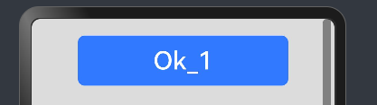
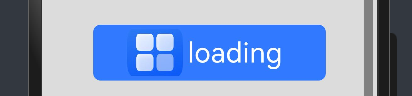
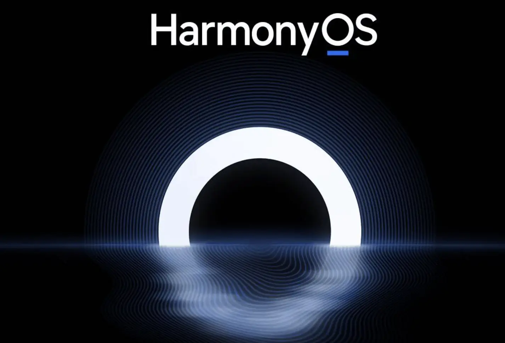

# 鸿蒙开发从零开始之按钮

---

这篇文章主要目的是初步学习按钮。

Button是按钮组件，通常用于响应用户的点击操作，其类型包括胶囊按钮、圆形按钮、普通按钮。Button做为容器使用时可以通过添加子组件实现包含文字、图片等元素的按钮。

---

# 建议

- 1.阅读按钮 (Button)官方文档

按钮 (Button)官方文档：

https://developer.huawei.com/consumer/cn/doc/harmonyos-guides-V5/arkts-common-components-button-V5

 - 2.绝知此事要躬行
 
 自己写一个Demo，验证文档中的属性。

 ---

# Demo

## 创建不包含子组件的按钮

Button通过调用接口来创建，接口调用有以下两种形式：

创建不包含子组件的按钮。

    Button(label?: ResourceStr, options?: { type?: ButtonType, stateEffect?: boolean })

其中，label用来设置按钮文字，type用于设置Button类型，stateEffect属性设置Button是否开启点击效果。

- 源码：

        //1.创建不包含子组件的按钮
        Button('Ok_1', { type: ButtonType.Normal, stateEffect: true })
          .fontSize(30)
          .borderRadius(8)
          .backgroundColor(0x317aff)
          .width(250)
          .height(60)
          .margin(20)

- UI效果

 ---

## 创建不包含子组件的按钮

创建包含子组件的按钮

    Button(options?: {type?: ButtonType, stateEffect?: boolean})

- 源码：

        //2.创建包含子组件的按钮
        Button({ type: ButtonType.Normal, stateEffect: true }) {
          Row() {
            Image($r('app.media.startIcon')).width(60).height(50).margin({ left: 2 })
            Text('loading').fontSize(30).fontColor(0xffffff).margin({ left: 5, right: 12 })
          }.alignItems(VerticalAlign.Center)
        }.borderRadius(8).backgroundColor(0x317aff)
        .width(250)
        .height(60)
        .margin(20)

- UI效果

 ---

## 设置按钮类型

Button有三种可选类型，分别为胶囊类型（Capsule）、圆形按钮（Circle）和普通按钮（Normal），通过type进行设置。

### 胶囊按钮（默认类型）

此类型按钮的圆角自动设置为高度的一半，不支持通过borderRadius属性重新设置圆角。

- 源码：

        //3.胶囊按钮（默认类型）
        Button('胶囊按钮', { type: ButtonType.Capsule, stateEffect: false })
          .backgroundColor(0x317aff)
          .fontSize(30)
          .width(250)
          .height(60)
          .margin(20)

- UI效果

---

### 圆形按钮

此类型按钮为圆形，不支持通过borderRadius属性重新设置圆角。

- 源码：

        //4.圆形按钮
        Button('圆形按钮', { type: ButtonType.Circle, stateEffect: false })
          .backgroundColor(0x317aff)
          .fontSize(30)
          .width(250)
          .height(60)
          .margin(20)

- UI效果

---

# 核心布局代码

[Index.ets](./Index.ets)

---

# 小结

- 确认鸿蒙系统与android系统的相似之处

鸿蒙系统相对布局和android系统的相对布局，整体来说设计是类似的。这个原因是各个系统的UI是基本基础，都是大同小异的。

- 确认鸿蒙系统与android系统的不同之处

属性的接口是不同的；

- 比较鸿蒙系统与android系统的优劣势

当前还无结论；

- 回答一下鸿蒙系统到底是不是android系统的套皮疑惑？

当前还无结论；

---

# 参考资料

1.按钮 (Button)：

https://developer.huawei.com/consumer/cn/doc/harmonyos-guides-V5/arkts-common-components-button-V5

---

# Demo源码

---

[跳转到文章开始](#鸿蒙开发从零开始之按钮)

---

---

