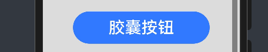
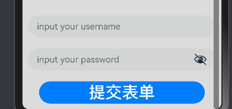

# 鸿蒙开发从零开始之按钮


---


[跳转到readme](https://github.com/hfreeman2008/Harmony-from-zero/blob/main/README.md)

---

[<font face='黑体' color=#ff0000 size=40 >跳转到文章结尾</font>](#Demo源码)

---

# 目的

这篇文章主要目的是初步学习按钮。

Button是按钮组件，通常用于响应用户的点击操作，其类型包括胶囊按钮、圆形按钮、普通按钮。Button做为容器使用时可以通过添加子组件实现包含文字、图片等元素的按钮。

---

# 建议

- 1.阅读按钮 (Button)官方文档

按钮 (Button)官方文档：

https://developer.huawei.com/consumer/cn/doc/harmonyos-guides-V5/arkts-common-components-button-V5

 - 2.绝知此事要躬行
 
 自己写一个Demo，验证文档中的属性。

 ---

# Demo

## 创建不包含子组件的按钮

Button通过调用接口来创建，接口调用有以下两种形式：

创建不包含子组件的按钮。

    Button(label?: ResourceStr, options?: { type?: ButtonType, stateEffect?: boolean })

其中，label用来设置按钮文字，type用于设置Button类型，stateEffect属性设置Button是否开启点击效果。

- 源码：

        //1.创建不包含子组件的按钮
        Button('Ok_1', { type: ButtonType.Normal, stateEffect: true })
          .fontSize(30)
          .borderRadius(8)
          .backgroundColor(0x317aff)
          .width(250)
          .height(60)
          .margin(20)

- UI效果


 ---

## 创建不包含子组件的按钮

创建包含子组件的按钮

    Button(options?: {type?: ButtonType, stateEffect?: boolean})


- 源码：

        //2.创建包含子组件的按钮
        Button({ type: ButtonType.Normal, stateEffect: true }) {
          Row() {
            Image($r('app.media.startIcon')).width(60).height(50).margin({ left: 2 })
            Text('loading').fontSize(30).fontColor(0xffffff).margin({ left: 5, right: 12 })
          }.alignItems(VerticalAlign.Center)
        }.borderRadius(8).backgroundColor(0x317aff)
        .width(250)
        .height(60)
        .margin(20)

- UI效果


 ---


## 设置按钮类型

Button有三种可选类型，分别为胶囊类型（Capsule）、圆形按钮（Circle）和普通按钮（Normal），通过type进行设置。

### 胶囊按钮（默认类型）

此类型按钮的圆角自动设置为高度的一半，不支持通过borderRadius属性重新设置圆角。


- 源码：

        //3.胶囊按钮（默认类型）
        Button('胶囊按钮', { type: ButtonType.Capsule, stateEffect: false })
          .backgroundColor(0x317aff)
          .fontSize(30)
          .width(250)
          .height(60)
          .margin(20)


- UI效果




---

### 圆形按钮

此类型按钮为圆形，不支持通过borderRadius属性重新设置圆角。


- 源码：

        //4.圆形按钮
        Button('圆形按钮', { type: ButtonType.Circle, stateEffect: false })
          .backgroundColor(0x317aff)
          .fontSize(30)
          .width(250)
          .height(60)
          .margin(20)

- UI效果


---

### 普通按钮

此类型的按钮默认圆角为0，支持通过borderRadius属性重新设置圆角。


- 源码：

        //5.普通按钮
        Button('普通按钮', { type: ButtonType.Normal, stateEffect: true })
          .borderRadius(8)
          .backgroundColor(0x317aff)
          .fontSize(30)
          .width(250)
          .height(60)
          .margin(20)


- UI效果


---

## 设置边框弧度

使用通用属性来自定义按钮样式。例如通过borderRadius属性设置按钮的边框弧度。


- 源码：

        //6.设置边框弧度
        Button('设置边框弧度', { type: ButtonType.Normal })
          .borderRadius(20)
          .fontSize(30)
          .width(250)
          .height(60)
          .margin(20)


- UI效果


---


## 设置文本样式

通过添加文本样式设置按钮文本的展示样式。


- 源码：

        //7.设置文本样式。
        Button('设置文本样式', { type: ButtonType.Normal })
          .fontColor(Color.Pink)
          .fontSize(30)
          .width(250)
          .height(60)
          .margin(20)


- UI效果


---

## 设置背景颜色

添加backgroundColor属性设置按钮的背景颜色。

- 源码：

        //8.设置背景颜色
        Button('设置背景颜色').backgroundColor(0xF55A42)
          .fontSize(30)
          .width(250)
          .height(60)
          .margin(20)


- UI效果


---

## 创建功能型按钮。

为删除操作创建一个按钮。

- 源码：

        //9.创建功能型按钮
        //let MarLeft: Record<string, number> = { 'left': 20 }
        Button({ type: ButtonType.Circle, stateEffect: true }) {
          Image($r('app.media.startIcon'))
            .width(50)
            .height(50)
        //}.width(55).height(55).margin(MarLeft).backgroundColor(0xF55A42)
        }.margin({ 'left': 20 }).backgroundColor(0xF55A42)
        .fontSize(30)
        .width(250)
        .height(60)
        .margin(20)


- UI效果


---

## 添加事件

Button组件通常用于触发某些操作，可以绑定onClick事件来响应点击操作后的自定义行为。

- 源码：

        //10.添加事件
        Button('添加事件', { type: ButtonType.Normal, stateEffect: true })
          .onClick(()=>{
            console.info('Button onClick')
          })
        .fontSize(30)
        .width(250)
        .height(60)
        .margin(20)


---


## 启动操作

可以用按钮启动任何用户界面元素，按钮会根据用户的操作触发相应的事件。例如，在List容器里通过点击按钮进行页面跳转。

- 源码：

```ets
    @State FurL:router.RouterOptions = {'url':'pages/first_page'}
    @State SurL:router.RouterOptions = {'url':'pages/second_page'}
    @State TurL:router.RouterOptions = {'url':'pages/third_page'}
```


        //11.用于启动操作
        List({ space: 4 }) {
          ListItem() {
            Button("First").onClick(() => {
              router.pushUrl(this.FurL)
              console.info('First Button onClick')
            })
              .width('100%')
              .fontSize(30)
          }.margin(20)
          ListItem() {
            Button("Second").onClick(() => {
              router.pushUrl(this.SurL)
              console.info('Second Button onClick')
            })
              .width('100%')
              .fontSize(30)
          }.margin(20)
          ListItem() {
            Button("Third").onClick(() => {
              router.pushUrl(this.TurL)
              console.info('Third Button onClick')
            })
              .width('100%')
              .fontSize(30)
          }.margin(20)
        }
        .listDirection(Axis.Vertical)
        .backgroundColor(0xDCDCDC).padding(20)


- UI效果


---

## 提交表单。

在用户登录/注册页面，使用按钮进行登录或注册操作。

- 源码：

        //12.提交表单
        Column() {
          TextInput({ placeholder: 'input your username' }).margin({ top: 10 }).fontSize(30)
          TextInput({ placeholder: 'input your password' }).type(InputType.Password).margin({ top: 20 })
          Button('提交表单').width(300).margin({ top: 20 }).fontSize(30)
            .onClick(() => {
              console.info('提交表单 Button onClick')
            })
        }.padding(10)


- UI效果




---

## 悬浮按钮

在可以滑动的界面，滑动时按钮始终保持悬浮状态。

- 源码：

        //13.悬浮按钮
        Button() {
          Image($r('app.media.app_icon'))
            .width(50)
            .height(50)
        }
        .onClick(() => {
          console.info('悬浮按钮 Button onClick')
        })
        .width(80)
        .height(80)
        .position({x: '80%', y: 1500})
        .shadow({radius: 10})


---


# 核心布局代码


[Index.ets](./Index.ets)

---

# Demo效果


---

# 小结


- 确认鸿蒙系统与android系统的相似之处

鸿蒙系统按钮和android系统的按钮，整体来说设计是类似的。这个原因是各个系统的UI是基本基础，都是大同小异的。


- 确认鸿蒙系统与android系统的不同之处

属性的接口是不同的；


- 比较鸿蒙系统与android系统的优劣势

当前还无结论；

---

# 参考资料

1.按钮 (Button)：

https://developer.huawei.com/consumer/cn/doc/harmonyos-guides-V5/arkts-common-components-button-V5


---

# Demo源码

ButtonDemo.rar


---

[<font face='黑体' color=#ff0000 size=40 >跳转到文章开始</font>](#鸿蒙开发从零开始之按钮)

---


---

