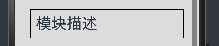
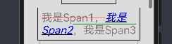
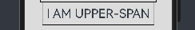
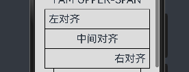
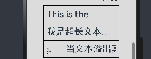
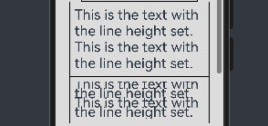
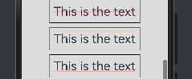

# 鸿蒙开发从零开始之文本显示

---

Text是文本组件，通常用于展示用户视图，如显示文章的文字。

这篇文章主要目的是初步学习文本显示 (Text/Span),重点是放在其属性上。

---

# 建议

- 1.阅读文本显示 (Text/Span)官方文档

文本显示 (Text/Span)官方文档：

https://developer.huawei.com/consumer/cn/doc/harmonyos-guides-V5/arkts-common-components-text-display-V5

 - 2.绝知此事要躬行
 
 自己写一个Demo，验证文档中的属性。

 ---

 # 创建文本

Text可通过以下两种方式来创建：

## string字符串

- 源码：

        //1.Text
        Text('我是一段文本')
          .fontSize(25)
          .margin(10)

- UI效果：

  ---

## 引用Resource资源

- 源码：

        //2.Text-引用Resource资源
        Text($r('app.string.module_desc'))
          .baselineOffset(0)
          .fontSize(30)
          .border({ width: 1 })
          .padding(10)
          .width(300)
          .margin(10)

- UI效果：

---

# 添加子组件

Span只能作为Text和RichEditor组件的子组件显示文本内容。可以在一个Text内添加多个Span来显示一段信息，例如产品说明书、承诺书等。

---

## 创建Span

Span组件需要写到Text组件内，单独写Span组件不会显示信息，Text与Span同时配置文本内容时，Span内容覆盖Text内容

- 源码：

        //3.创建Span
        Text('我是Text') {
          Span('我是Span')
        }
        .fontSize(30)
        .padding(10)
        .borderWidth(1)
        .margin(10)

- UI效果：

---

## 设置文本装饰线及颜色

- 源码：

        //4.设置文本装饰线及颜色
        Text() {
          Span('我是Span1，').fontSize(16).fontColor(Color.Grey).fontSize(30)
            .decoration({ type: TextDecorationType.LineThrough, color: Color.Red })
          Span('我是Span2').fontColor(Color.Blue).fontSize(30)
            .fontStyle(FontStyle.Italic)
            .decoration({ type: TextDecorationType.Underline, color: Color.Black })
          Span('，我是Span3').fontSize(30).fontColor(Color.Grey)
            .decoration({ type: TextDecorationType.Overline, color: Color.Green })
        }
        .borderWidth(1)
        .padding(10)

- UI效果：

---

## 通过textCase设置文字一直保持大写或者小写状态

- 源码：

        //5.通过textCase设置文字一直保持大写或者小写状态
        Text() {
          Span('I am Upper-span').fontSize(30)
            .textCase(TextCase.UpperCase)
        }
        .borderWidth(1)
        .padding(10)

- UI效果：

---

## 添加事件

- 源码：

        //6.添加事件
        Text() {
          Span('I am Upper-span').fontSize(30)
            .textCase(TextCase.UpperCase)
            .onClick(()=>{
              console.info('我是Span——onClick')
            })
        }
        .padding(10)

---

# 自定义文本样式

## 通过textAlign属性设置文本对齐样式

- 源码：

        //7.通过textAlign属性设置文本对齐样式
        Text('左对齐')
          .width(300)
          .textAlign(TextAlign.Start)
          .border({ width: 1 })
          .padding(10)
          .fontSize(30)
        Text('中间对齐')
          .width(300)
          .textAlign(TextAlign.Center)
          .border({ width: 1 })
          .padding(10)
          .fontSize(30)
        Text('右对齐')
          .width(300)
          .textAlign(TextAlign.End)
          .border({ width: 1 })
          .padding(10)
          .fontSize(30)

- UI效果：

---

## 通过textOverflow属性控制文本超长处理，textOverflow需配合maxLines一起使用

（默认情况下文本自动折行）

- 源码：

        //8.通过textOverflow属性控制文本超长处理，textOverflow需配合maxLines一起使用
        Text('This is the setting of textOverflow to Clip text content This is the setting of textOverflow to None text content. This is the setting of textOverflow to Clip text content This is the setting of textOverflow to None text content.')
          .width(250)
          .textOverflow({ overflow: TextOverflow.None })
          .maxLines(1)
          .fontSize(30)
          .border({ width: 1 })
          .padding(10)
        Text('我是超长文本，超出的部分显示省略号。I am an extra long text, with ellipses displayed for any excess。')
          .width(250)
          .textOverflow({ overflow: TextOverflow.Ellipsis })
          .maxLines(1)
          .fontSize(30)
          .border({ width: 1 })
          .padding(10)
        Text('当文本溢出其尺寸时，文本将滚动显示。When the text overflows its dimensions, the text will scroll for displaying.')
          .width(250)
          .textOverflow({ overflow: TextOverflow.MARQUEE })
          .maxLines(1)
          .fontSize(30)
          .border({ width: 1 })
          .padding(10)

- UI效果：

---

## 通过lineHeight属性设置文本行高

- 源码：

        //9.通过lineHeight属性设置文本行高
        Text('This is the text with the line height set. This is the text with the line height set.')
          .width(300).fontSize(30).border({ width: 1 }).padding(10)
        Text('This is the text with the line height set. This is the text with the line height set.')
          .width(300).fontSize(30).border({ width: 1 }).padding(10)
          .lineHeight(20)

- UI效果：

---

## 通过decoration属性设置文本装饰线样式及其颜色。

- 源码：

        //10.通过decoration属性设置文本装饰线样式及其颜色
        Text('This is the text')
          .decoration({
            type: TextDecorationType.LineThrough,
            color: Color.Red
          })
          .borderWidth(1).padding(10).margin(5).fontSize(30)
        Text('This is the text')
          .decoration({
            type: TextDecorationType.Overline,
            color: Color.Red
          })
          .borderWidth(1).padding(10).margin(5).fontSize(30)
        Text('This is the text')
          .decoration({
            type: TextDecorationType.Underline,
            color: Color.Red
          })
          .borderWidth(1).padding(10).margin(5).fontSize(30)

- UI效果：

---

---

---

# Demo效果

  

---

# 核心布局代码

[Index.ets](./Index.ets)

---

# 小结

- 确认鸿蒙系统与android系统的相似之处

鸿蒙系统和文本显示 (Text/Span)和android系统的TextView，整体来说设计是类似的。这个原因是各个系统的UI是基本基础，都是大同小异的。

- 确认鸿蒙系统与android系统的不同之处

属性的接口是不同的；

- 比较鸿蒙系统与android系统的优劣势

当前还无结论；

- 回答一下鸿蒙系统到底是不是android系统的套皮疑惑？

当前还无结论；

---

# 参考资料

1.文本显示 (Text/Span)

https://developer.huawei.com/consumer/cn/doc/harmonyos-guides-V5/arkts-common-components-text-display-V5

---

# Demo源码

---

[跳转到文章开始](#鸿蒙开发从零开始之文本显示)

---

---

