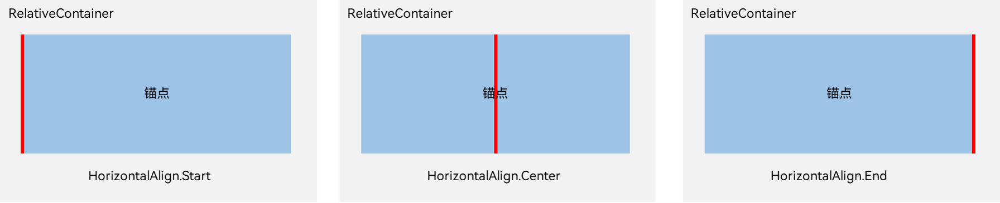
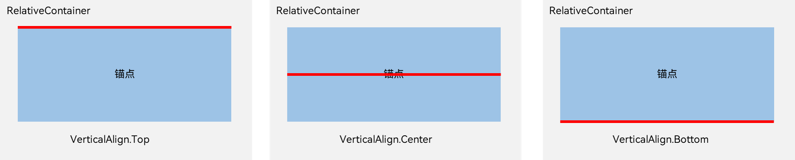
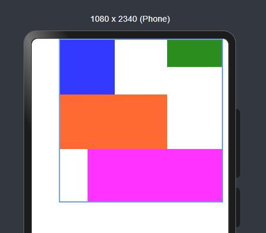
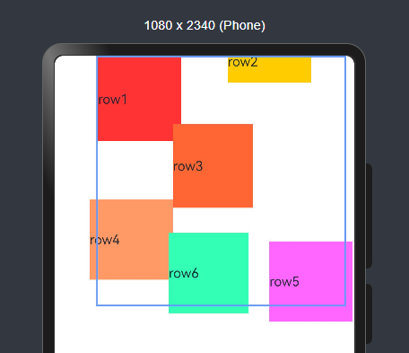

# 鸿蒙开发从零开始之相对布局

---

这篇文章主要目的是初步学习相对布局 (RelativeContainer),重点是放在其属性上。

---

# 建议

- 1.阅读相对布局 (RelativeContainer)官方文档

相对布局 (RelativeContainer)官方文档：

https://developer.huawei.com/consumer/cn/doc/harmonyos-guides-V5/arkts-layout-development-relative-layout-V5

 - 2.绝知此事要躬行
 
 自己写一个Demo，验证文档中的属性。

 ---

# 基本概念

锚点：通过锚点设置当前元素基于哪个元素确定位置。

对齐方式：通过对齐方式，设置当前元素是基于锚点的上中下对齐，还是基于锚点的左中右对齐。

 ---

# 设置相对于锚点的对齐位置

设置了锚点之后，可以通过align设置相对于锚点的对齐位置。

在水平方向上，对齐位置可以设置为HorizontalAlign.Start、HorizontalAlign.Center、HorizontalAlign.End。

在竖直方向上，对齐位置可以设置为VerticalAlign.Top、VerticalAlign.Center、VerticalAlign.Bottom。

 ---

# 相对布局 (RelativeContainer)的Demo

## Demo 1-alignRules

- 源码：

    //Demo 1
    RelativeContainer() {

      Row().width(100).height(100)
        .backgroundColor('#ff3339ff')
        .alignRules({
          top: {anchor: "__container__", align: VerticalAlign.Top},
          left: {anchor: "__container__", align: HorizontalAlign.Start}
        })
        .id("row1")

      Row().width(100)
        .backgroundColor('#ff298e1e')
        .alignRules({
          top: {anchor: "__container__", align: VerticalAlign.Top},
          right: {anchor: "__container__", align: HorizontalAlign.End},
          bottom: {anchor: "row1", align: VerticalAlign.Center},
        })
        .id("row2")

      Row().height(100)
        .backgroundColor('#ffff6a33')
        .alignRules({
          top: {anchor: "row1", align: VerticalAlign.Bottom},
          left: {anchor: "row1", align: HorizontalAlign.Start},
          right: {anchor: "row2", align: HorizontalAlign.Start}
        })
        .id("row3")

      Row()
        .backgroundColor('#ffff33fd')
        .alignRules({
          top: {anchor: "row3", align: VerticalAlign.Bottom},
          left: {anchor: "row1", align: HorizontalAlign.Center},
          right: {anchor: "row2", align: HorizontalAlign.End},
          bottom: {anchor: "__container__", align: VerticalAlign.Bottom}
        })
        .id("row4")

    }
    .width(300).height(300)
    .margin({left: 50})
    .border({width:2, color: "#6699FF"})

- UI效果：

  

---

## Demo 2-子组件位置偏移offset

子组件经过相对位置对齐后，位置可能还不是目标位置，开发者可根据需要进行额外偏移设置offset。

- 源码：

    //Demo 2
    RelativeContainer() {
      Row(){
        Text('row1')
      }.width(100).height(100)
        .backgroundColor("#FF3333")
        .alignRules({
          top: {anchor: "__container__", align: VerticalAlign.Top},
          left: {anchor: "__container__", align: HorizontalAlign.Start}
        })
        .id("row1")

      Row(){
        Text('row2')
      }.width(100)
        .backgroundColor("#FFCC00")
        .alignRules({
          top: {anchor: "__container__", align: VerticalAlign.Top},
          right: {anchor: "__container__", align: HorizontalAlign.End},
          bottom: {anchor: "row1", align: VerticalAlign.Center},
        })
        .offset({
          x:-40,
          y:-20
        })
        .id("row2")

      Row(){
        Text('row3')
      }
      .height(100)
        .backgroundColor("#FF6633")
        .alignRules({
          top: {anchor: "row1", align: VerticalAlign.Bottom},
          left: {anchor: "row1", align: HorizontalAlign.End},
          right: {anchor: "row2", align: HorizontalAlign.Start}
        })
        .offset({
          x:-10,
          y:-20
        })
        .id("row3")

      Row(){
        Text('row4')
      }
        .backgroundColor("#FF9966")
        .alignRules({
          top: {anchor: "row3", align: VerticalAlign.Bottom},
          bottom: {anchor: "__container__", align: VerticalAlign.Bottom},
          left: {anchor: "__container__", align: HorizontalAlign.Start},
          right: {anchor: "row1", align: HorizontalAlign.End}
        })
        .offset({
          x:-10,
          y:-30
        })
        .id("row4")

      Row(){
        Text('row5')
      }
        .backgroundColor("#FF66FF")
        .alignRules({
          top: {anchor: "row3", align: VerticalAlign.Bottom},
          bottom: {anchor: "__container__", align: VerticalAlign.Bottom},
          left: {anchor: "row2", align: HorizontalAlign.Start},
          right: {anchor: "row2", align: HorizontalAlign.End}
        })
        .offset({
          x:10,
          y:20
        })
        .id("row5")

      Row(){
        Text('row6')
      }
        .backgroundColor('#ff33ffb5')
        .alignRules({
          top: {anchor: "row3", align: VerticalAlign.Bottom},
          bottom: {anchor: "row4", align: VerticalAlign.Bottom},
          left: {anchor: "row3", align: HorizontalAlign.Start},
          right: {anchor: "row3", align: HorizontalAlign.End}
        })
        .offset({
          x:-15,
          y:10
        })
        .backgroundImagePosition(Alignment.Bottom)
        .backgroundImageSize(ImageSize.Cover)
        .id("row6")
    }
    .width(300).height(300)
    .margin({left: 50})
    .border({width:2, color: "#6699FF"})

- UI效果：

  

---

# 核心布局代码

[Index.ets](./Index.ets)

---

# 小结

- 确认鸿蒙系统与android系统的相似之处

鸿蒙系统和线性布局和android系统的线性布局，整体来说设计是类似的。这个原因是各个系统的UI是基本基础，都是大同小异的。

- 确认鸿蒙系统与android系统的不同之处

属性的接口是不同的；

- 比较鸿蒙系统与android系统的优劣势

当前还无结论；

- 回答一下鸿蒙系统到底是不是android系统的套皮疑惑？

当前还无结论；

---

# 参考资料

1.相对布局 (RelativeContainer)：

https://developer.huawei.com/consumer/cn/doc/harmonyos-guides-V5/arkts-layout-development-relative-layout-V5

---

# Demo源码

---

[跳转到文章开始](#鸿蒙开发从零开始之相对布局)

---

---

