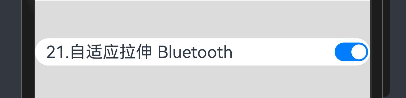

# 鸿蒙开发从零开始之线性布局


---

这篇文章主要目的是初步学习线性布局(Row/Column),重点是放在其属性上。

---


# 建议

- 1.阅读线性布局 (Row/Column)官方文档

线性布局 (Row/Column)官方文档：

https://developer.huawei.com/consumer/cn/doc/harmonyos-guides-V5/arkts-layout-development-linear-V5

 - 2.绝知此事要躬行
 
 自己写一个Demo，验证文档中的属性。看和写完全是二回事，当我自己把这些属性验证后，有一种鸿蒙开发进门的感觉。

这种感觉和当年学习android开发似曾相识啊！


 ---

# 线性布局 (Row/Column) 各种属性

 ---

## 布局子元素在排列方向上的间距

在布局容器内，可以通过space属性设置排列方向上子元素的间距，使各子元素在排列方向上有等间距效果。

### Column容器内排列方向上的间距


- 源码：

    //1.Column

    Column({ space: 20 }) {
        Text('1.Column space: 20').fontSize(25).fontColor(Color.Gray).width('90%')
        Row().width('90%').height(20).backgroundColor(0xF5DEB3)
        Row().width('90%').height(20).backgroundColor(0xD2B48C)
        Row().width('90%').height(20).backgroundColor(0xF5DEB3)
    }.width('100%').margin(10)

- UI效果：


---

### Row容器内排列方向上的间距


- 源码：

    //2.Row

    Row({ space: 35 }) {
        Text('2.Row space: 35').fontSize(25).fontColor(Color.Gray)
        Row().width('10%').height(50).backgroundColor(0x0000FF)
        Row().width('10%').height(50).backgroundColor(0x871F78)
        Row().width('10%').height(50).backgroundColor(0x0000FF)
    }.width('90%').margin(20)

- UI效果：


---

## 布局子元素在交叉轴上的对齐方式

在布局容器内，可以通过alignItems属性设置子元素在交叉轴（排列方向的垂直方向）上的对齐方式。且在各类尺寸屏幕中，表现一致。其中，交叉轴为垂直方向时，取值为VerticalAlign类型，水平方向取值为HorizontalAlign。

### Column容器内子元素在水平方向上的排列


- 源码：

        //3.Column alignItems HorizontalAlign.Start
        Column({}) {
          Column() {
            Text('3.Column alignItems HorizontalAlign.Start').fontSize(18).fontColor(Color.Gray).width('100%')
          }.width('80%').height(50).backgroundColor(0xF5DEB3)

          Column() {
          }.width('80%').height(50).backgroundColor(0xD2B48C)

          Column() {
          }.width('80%').height(50).backgroundColor(0xF5DEB3)
        }.width('100%').alignItems(HorizontalAlign.Start).backgroundColor('rgb(242,242,242)').margin(20)


        //4.Column alignItems HorizontalAlign.Center
        Column({}) {
          Column() {
            Text('4.Column alignItems HorizontalAlign.Center').fontSize(18).fontColor(Color.Gray).width('100%')
          }.width('80%').height(50).backgroundColor(0x0000FF)

          Column() {
          }.width('80%').height(50).backgroundColor(0x871F78)

          Column() {
          }.width('80%').height(50).backgroundColor(0x0000FF)
        }.width('100%').alignItems(HorizontalAlign.Center).backgroundColor('rgb(242,242,242)').margin(20)

        //5.Column alignItems HorizontalAlign.End
        Column({}) {
          Column() {
            Text('5.Column alignItems HorizontalAlign.End').fontSize(18).fontColor(Color.Gray).width('100%')
          }.width('80%').height(50).backgroundColor(0xF5DEB3)

          Column() {
          }.width('80%').height(50).backgroundColor(0xD2B48C)

          Column() {
          }.width('80%').height(50).backgroundColor(0xF5DEB3)
        }.width('100%').alignItems(HorizontalAlign.End).backgroundColor('rgb(242,242,242)').margin(20)


- UI效果：


---

### Row容器内子元素在垂直方向上的排列


- 源码：


        //6.Row alignItems VerticalAlign.Top
        Row({}) {
          Column() {
            Text('6.Column alignItems VerticalAlign.Top').fontSize(18).fontColor(Color.Gray).width('100%')
          }.width('20%').height(30).backgroundColor(0x0000FF)

          Column() {
          }.width('20%').height(30).backgroundColor(0x871F78)

          Column() {
          }.width('20%').height(30).backgroundColor(0x0000FF)
        }.width('100%').height(100).alignItems(VerticalAlign.Top).backgroundColor('rgb(242,242,242)').margin(20)

        //7.Row alignItems VerticalAlign.Center
        Row({}) {
          Column() {
            Text('7.Column alignItems VerticalAlign.Center').fontSize(18).fontColor(Color.Gray).width('100%')
          }.width('20%').height(30).backgroundColor(0xF5DEB3)

          Column() {
          }.width('20%').height(30).backgroundColor(0xD2B48C)

          Column() {
          }.width('20%').height(30).backgroundColor(0xF5DEB3)
        }.width('100%').height(100).alignItems(VerticalAlign.Center).backgroundColor('rgb(242,242,242)').margin(20)

        //8.Row alignItems VerticalAlign.Bottom
        Row({}) {
          Column() {
            Text('8.Column alignItems VerticalAlign.Bottom').fontSize(18).fontColor(Color.Gray).width('100%')
          }.width('20%').height(30).backgroundColor(0x0000FF)

          Column() {
          }.width('20%').height(30).backgroundColor(0x871F78)

          Column() {
          }.width('20%').height(30).backgroundColor(0x0000FF)
        }.width('100%').height(100).alignItems(VerticalAlign.Bottom).backgroundColor('rgb(242,242,242)').margin(20)


- UI效果：


---

## 布局子元素在主轴上的排列方式

在布局容器内，可以通过justifyContent属性设置子元素在容器主轴上的排列方式。可以从主轴起始位置开始排布，也可以从主轴结束位置开始排布，或者均匀分割主轴的空间。

---

### Column容器内子元素在垂直方向上的排列


- 源码：

        //9.Column justifyContent FlexAlign.Start
        Column({}) {
          Column() {
            Text('9.Column justifyContent FlexAlign.Start').fontSize(18).fontColor(Color.Gray).width('100%')
          }.width('80%').height(50).backgroundColor(0xF5DEB3)

          Column() {
          }.width('80%').height(50).backgroundColor(0xD2B48C)

          Column() {
          }.width('80%').height(50).backgroundColor(0xF5DEB3)
        }.width('100%').height(250).backgroundColor('rgb(242,242,242)').justifyContent(FlexAlign.Start).margin(20)


        //14.Column justifyContent FlexAlign.SpaceEvenly
        Column({}) {
          Column() {
            Text('14.Column justifyContent FlexAlign.SpaceEvenly').fontSize(18).fontColor(Color.Gray).width('100%')
          }.width('80%').height(50).backgroundColor(0x0000FF)

          Column() {
          }.width('80%').height(50).backgroundColor(0x871F78)

          Column() {
          }.width('80%').height(50).backgroundColor(0x0000FF)
        }.width('100%').height(250).backgroundColor('rgb(242,242,242)').justifyContent(FlexAlign.SpaceEvenly).margin(20)


- UI效果：


---

### Row容器内子元素在水平方向上的排列


- 源码：

        //15.Row justifyContent FlexAlign.Start
        Row({}) {
          Column() {
            Text('15.Row justifyContent FlexAlign.Start').fontSize(18).fontColor(Color.Gray).width('100%')
          }.width('20%').height(30).backgroundColor(0xF5DEB3)

          Column() {
          }.width('20%').height(30).backgroundColor(0xD2B48C)

          Column() {
          }.width('20%').height(30).backgroundColor(0xF5DEB3)
        }.width('100%').height(150).backgroundColor('rgb(242,242,242)').justifyContent(FlexAlign.Start).margin(20)


        //20.Row justifyContent FlexAlign.SpaceEvenly
        Row({}) {
          Column() {
            Text('20.Row justifyContent FlexAlign.SpaceEvenly').fontSize(18).fontColor(Color.Gray).width('100%')
          }.width('20%').height(30).backgroundColor(0x0000FF)

          Column() {
          }.width('20%').height(30).backgroundColor(0x871F78)

          Column() {
          }.width('20%').height(30).backgroundColor(0x0000FF)
        }.width('100%').height(200).backgroundColor('rgb(242,242,242)').justifyContent(FlexAlign.SpaceEvenly).margin(20)


- UI效果：


---

## 自适应拉伸

在线性布局下，常用空白填充组件Blank，在容器主轴方向自动填充空白空间，达到自适应拉伸效果。Row和Column作为容器，只需要添加宽高为百分比，当屏幕宽高发生变化时，会产生自适应效果。

- 源码：

        //21.Blank 自适应拉伸
        Row() {
          Text('21.自适应拉伸 Bluetooth').fontSize(18)
          Blank()
          Toggle({ type: ToggleType.Switch, isOn: true })
        }.backgroundColor(0xFFFFFF).borderRadius(15).padding({ left: 12 }).width('100%').margin(20)


- UI效果：




---

## 自适应缩放

自适应缩放是指子元素随容器尺寸的变化而按照预设的比例自动调整尺寸，适应各种不同大小的设备。在线性布局中，可以使用以下两种方法实现自适应缩放。

---

### layoutWeight

父容器尺寸确定时，使用layoutWeight属性设置子元素和兄弟元素在主轴上的权重，忽略元素本身尺寸设置，使它们在任意尺寸的设备下自适应占满剩余空间。

- 源码：

        //22.自适应缩放 layoutWeight
        Column() {
          Text('22.自适应缩放 layoutWeight 1:2:3').width('100%')
          Row() {
            Column() {
              Text('layoutWeight(1)')
                .textAlign(TextAlign.Center)
            }.layoutWeight(1).backgroundColor(0xF5DEB3).height('100%')

            Column() {
              Text('layoutWeight(2)')
                .textAlign(TextAlign.Center)
            }.layoutWeight(2).backgroundColor(0xD2B48C).height('100%')

            Column() {
              Text('layoutWeight(3)')
                .textAlign(TextAlign.Center)
            }.layoutWeight(3).backgroundColor(0xF5DEB3).height('100%')

          }.backgroundColor(0xffd306).height('30%')

          Text('22.自适应缩放 layoutWeight 2:5:3').width('100%')
          Row() {
            Column() {
              Text('layoutWeight(2)')
                .textAlign(TextAlign.Center)
            }.layoutWeight(2).backgroundColor(0xF5DEB3).height('100%')

            Column() {
              Text('layoutWeight(5)')
                .textAlign(TextAlign.Center)
            }.layoutWeight(5).backgroundColor(0xD2B48C).height('100%')

            Column() {
              Text('layoutWeight(3)')
                .textAlign(TextAlign.Center)
            }.layoutWeight(3).backgroundColor(0xF5DEB3).height('100%')
          }.backgroundColor(0xffd306).height('30%')
        }.margin(20)


- UI效果：


---

### width

父容器尺寸确定时，使用百分比设置子元素和兄弟元素的宽度，使他们在任意尺寸的设备下保持固定的自适应占比。


- 源码：

        //23.自适应缩放 width 百分比
        Column() {
          Row() {
            Column() {
              Text('23.自适应缩放 width 百分比 left width 20%')
                .textAlign(TextAlign.Center)
            }.width('20%').backgroundColor(0xF5DEB3).height('100%')

            Column() {
              Text('center width 50%')
                .textAlign(TextAlign.Center)
            }.width('50%').backgroundColor(0xD2B48C).height('100%')

            Column() {
              Text('right width 30%')
                .textAlign(TextAlign.Center)
            }.width('30%').backgroundColor(0xF5DEB3).height('100%')
          }.backgroundColor(0xffd306).height('30%')
        }.margin(20)


- UI效果：


---

## 自适应延伸

自适应延伸是指在不同尺寸设备下，当页面的内容超出屏幕大小而无法完全显示时，可以通过滚动条进行拖动展示。这种方法适用于线性布局中内容无法一屏展示的场景。通常有以下两种实现方式。

在List中添加滚动条：当List子项过多一屏放不下时，可以将每一项子元素放置在不同的组件中，通过滚动条进行拖动展示。可以通过scrollBar属性设置滚动条的常驻状态，edgeEffect属性设置拖动到内容最末端的回弹效果。

使用Scroll组件：在线性布局中，开发者可以进行垂直方向或者水平方向的布局。当一屏无法完全显示时，可以在Column或Row组件的外层包裹一个可滚动的容器组件Scroll来实现可滑动的线性布局。

垂直方向布局中使用Scroll组件：

- Scroll源码：

```java
@Entry
@Component
struct ScrollExample {
  scroller: Scroller = new Scroller();
  private arr: number[] = [0, 1, 2, 3, 4, 5, 6, 7, 8, 9];

  build() {
    Scroll(this.scroller) {
      Column() {
        ForEach(this.arr, (item?:number|undefined) => {
          if(item){
            Text(item.toString())
            .width('90%')
            .height(150)
            .backgroundColor(0xFFFFFF)
            .borderRadius(15)
            .fontSize(16)
            .textAlign(TextAlign.Center)
            .margin({ top: 10 })
          }
        }, (item:number) => item.toString())
      }.width('100%')
    }
    .backgroundColor(0xDCDCDC)
    .scrollable(ScrollDirection.Vertical) // 滚动方向为垂直方向
    .scrollBar(BarState.On) // 滚动条常驻显示
    .scrollBarColor(Color.Gray) // 滚动条颜色
    .scrollBarWidth(10) // 滚动条宽度
    .edgeEffect(EdgeEffect.Spring) // 滚动到边沿后回弹
  }
}
```


- Demo源码：

        //24.自适应延伸
        Column() {
          ForEach(this.arr, (item?:number|undefined) => {
            if(item){
              Text('24.自适应延伸' + item.toString())
                .width('90%')
                .height(50)
                .backgroundColor(0xFFFFFF)
                .borderRadius(15)
                .fontSize(16)
                .textAlign(TextAlign.Center)
                .margin({ top: 10 })
            }
          }, (item:number) => item.toString())
        }.width('100%').margin(20)

- UI效果：


---


# 核心布局代码


[Index.ets](./Index.ets)

---

# 小结


- 确认鸿蒙系统与android系统的相似之处

鸿蒙系统和线性布局和android系统的线性布局，整体来说设计是类似的。这个原因是各个系统的UI是基本基础，都是大同小异的。


- 确认鸿蒙系统与android系统的不同之处

属性的接口是不同的；


- 比较鸿蒙系统与android系统的优劣势

当前还无结论；


- 回答一下鸿蒙系统到底是不是android系统的套皮疑惑？

当前还无结论；

---

# 参考资料

1.线性布局 (Row/Column)：

https://developer.huawei.com/consumer/cn/doc/harmonyos-guides-V5/arkts-layout-development-linear-V5


---

# Demo源码

RowColumnDemo.rar

---

[<font face='黑体' color=#ff0000 size=40 >跳转到文章开始</font>](#鸿蒙开发从零开始之线性布局)

---


---

