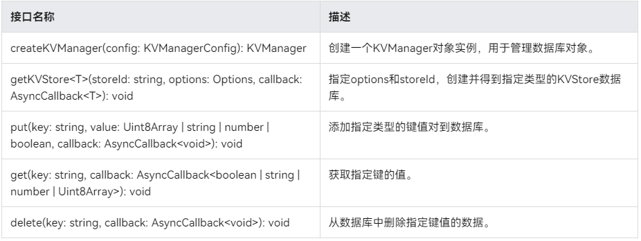

# 鸿蒙开发从零开始之键值型数据库


---

[<font face='黑体' color=#ff0000 size=40 >跳转到文章结尾</font>](#Demo源码)

---

这篇文章主要目的是初步学习键值型数据库实现数据持久化的使用；


对入鸿蒙开发，数据保存是一个最基本的需求。

而键值型数据库，对于简单的数据存储，是可以满足用户的需求的；

---

# 键值型数据库

## 适用场景
键值型数据库存储键值对形式的数据，当需要存储的数据没有复杂的关系模型，比如存储商品名称及对应价格、员工工号及今日是否已出勤等，由于数据复杂度低，更容易兼容不同数据库版本和设备类型，因此推荐使用键值型数据库持久化此类数据。


## 约束限制
- 设备协同数据库，针对每条记录，Key的长度≤896 Byte，Value的长度<4 MB。
- 单版本数据库，针对每条记录，Key的长度≤1 KB，Value的长度<4 MB。
- 每个应用程序最多支持同时打开16个键值型分布式数据库。
- 键值型数据库事件回调方法中不允许进行阻塞操作，例如修改UI组件。

## 接口说明

以下是键值型数据库持久化功能的相关接口，大部分为异步接口。异步接口均有callback和Promise两种返回形式，下表均以callback形式为例，更多接口及使用方式请见分布式键值数据库。




接口名称|描述|
-|-|
createKVManager(config: KVManagerConfig): KVManager |创建一个KVManager对象实例，用于管理数据库对象。|
getKVStore<T>(storeId: string, options: Options, callback: AsyncCallback<T>): void | 指定options和storeId，创建并得到指定类型的KVStore数据库。 |
put(key: string, value:, callback: AsyncCallback<void>): void | 添加指定类型的键值对到数据库。 |
get(key: string, callback: AsyncCallback<>): void | 获取指定键的值。|
delete(key: string, callback: AsyncCallback<void>): void | 从数据库中删除指定键值的数据。 |


# 核心代码


## 关键逻辑说明


1.引入包

```java
import { window } from '@kit.ArkUI';
import { distributedKVStore } from '@kit.ArkData';
import { BusinessError } from '@kit.BasicServicesKit';
```

2.定义变量：

```java
let kvManager: distributedKVStore.KVManager | undefined = undefined;
let kvStore: distributedKVStore.SingleKVStore | undefined = undefined;
```

3.初始化kvManager
```java
//1:init kvManager
let context = this.context;
const kvManagerConfig: distributedKVStore.KVManagerConfig = {
    context: context,
    bundleName: 'com.example.kvstoredemo'
};
try {
    // 创建KVManager实例
    kvManager = distributedKVStore.createKVManager(kvManagerConfig);
    console.info('Succeeded in creating KVManager.');
    try {
    const options: distributedKVStore.Options = {
        createIfMissing: true,
        encrypt: false,
        backup: false,
        autoSync: false,
        kvStoreType: distributedKVStore.KVStoreType.SINGLE_VERSION,// kvStoreType不填时，默认创建多设备协同数据库
        securityLevel: distributedKVStore.SecurityLevel.S1// 多设备协同数据库：kvStoreType: distributedKVStore.KVStoreType.DEVICE_COLLABORATION,
    };
```


4.初始化kvStore实例

```java
//2 init kvStore实例
if (kvManager !== undefined) {
    kvManager = kvManager as distributedKVStore.KVManager;
    kvManager.getKVStore<distributedKVStore.SingleKVStore>('storeId', options, (err, store: distributedKVStore.SingleKVStore) => {
    if (err) {
        console.error(`Failed to get KVStore: Code:${err.code},message:${err.message}`);
        return;
    }
    console.info('Succeeded in getting KVStore.');
    kvStore = store;

    if (kvStore !== undefined) {
        kvStore = kvStore as distributedKVStore.SingleKVStore;
```

5.put数据

```java
//3.put data
const KEY_TEST_STRING_ELEMENT = 'key_test_string';
const VALUE_TEST_STRING_ELEMENT = 'value_test_string';
try {
kvStore.put(KEY_TEST_STRING_ELEMENT, VALUE_TEST_STRING_ELEMENT, (err) => {
    if (err !== undefined) {
    console.error(`Failed to put data. Code:${err.code},message:${err.message}`);
    return;
    }
    console.info('Succeeded in putting data one.');
});
} catch (e) {
let error = e as BusinessError;
console.error(`An unexpected error occurred. Code:${error.code},message:${error.message}`);
}
```


6.get数据

```java
//4. get data
try {
kvStore.put(KEY_TEST_STRING_ELEMENT, VALUE_TEST_STRING_ELEMENT, (err) => {
    if (err !== undefined) {
    console.error(`Failed to put data. Code:${err.code},message:${err.message}`);
    return;
    }
    console.info('Succeeded in putting data two.');
    kvStore = kvStore as distributedKVStore.SingleKVStore;
    kvStore.get(KEY_TEST_STRING_ELEMENT, (err, data) => {
    if (err != undefined) {
        console.error(`Failed to get data. Code:${err.code},message:${err.message}`);
        return;
    }
    console.info(`Succeeded in getting data. Data:${data}`);
    });
});
} catch (e) {
let error = e as BusinessError;
console.error(`Failed to get data. Code:${error.code},message:${error.message}`);
}
```


7.delete数据

```java
//5. delete data
try {
kvStore.put(KEY_TEST_STRING_ELEMENT, VALUE_TEST_STRING_ELEMENT, (err) => {
    if (err !== undefined) {
    console.error(`Failed to put data. Code:${err.code},message:${err.message}`);
    return;
    }
    console.info('Succeeded in putting data three.');
    kvStore = kvStore as distributedKVStore.SingleKVStore;
    kvStore.delete(KEY_TEST_STRING_ELEMENT, (err) => {
    if (err !== undefined) {
        console.error(`Failed to delete data. Code:${err.code},message:${err.message}`);
        return;
    }
    console.info('Succeeded in deleting data.');
    });
});
} catch (e) {
let error = e as BusinessError;
console.error(`An unexpected error occurred. Code:${error.code},message:${error.message}`);
}
```


8.输出日志

```java
A00000/testTag  I     Ability onCreate
A03d00/JSAPP    I     Succeeded in creating KVManager.
A00000/testTag  I     Ability onWindowStageCreate
A00000/testTag  I     Ability onForeground
A00000/testTag  I     Succeeded in loading the content.
A03d00/JSAPP    I     Succeeded in getting KVStore.
A03d00/JSAPP    I     Succeeded in putting data one.
A03d00/JSAPP    I     Succeeded in getting data. Data:value_test_string
```


---

# 参考资料

1.通过键值型数据库实现数据持久化

https://developer.huawei.com/consumer/cn/doc/harmonyos-guides-V5/data-persistence-by-kv-store-V5


---

# Demo源码

Demo:

基于SDK 12(5.0.0)版本，完成调试，可以运行。

KVStoreDemo.rar

---

[<font face='黑体' color=#ff0000 size=40 >跳转到文章开始</font>](#鸿蒙开发从零开始之键值型数据库)

---


---

