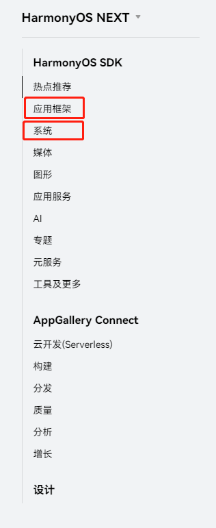

# 鸿蒙开发从零开始系列文章的目的

---

[跳转到readme](https://github.com/hfreeman2008/Harmony-from-zero/blob/main/README.md)

---

[跳转到文章结尾](#参考资料)

---

# 项目的目的

- 学习鸿蒙开发

通过这个项目，我们可以来完成鸿蒙开发的入门；

这个可以说是这个项目的最核心目的！！

- 确认鸿蒙系统与android系统的相似之处

此项目的学习，我们参考android系统的开发，来看看二个系统开发的相似之处；

- 确认鸿蒙系统与android系统的不同之处

此项目的学习，我们参考android系统的开发，来看看二个系统开发的不同之处；

- 比较鸿蒙系统与android系统的优劣势

此项目的学习，我们参考android系统的开发，来看看二个系统的优劣势；

---

# HarmonyOS的模块拼图

其中，我们主要学习的模块在：

- 应用框架

- 系统

---

# 参考资料

1.HarmonyOS SDK

https://developer.huawei.com/consumer/cn/doc/

---

[跳转到文章开始](#鸿蒙开发从零开始系列文章的目的)

---

